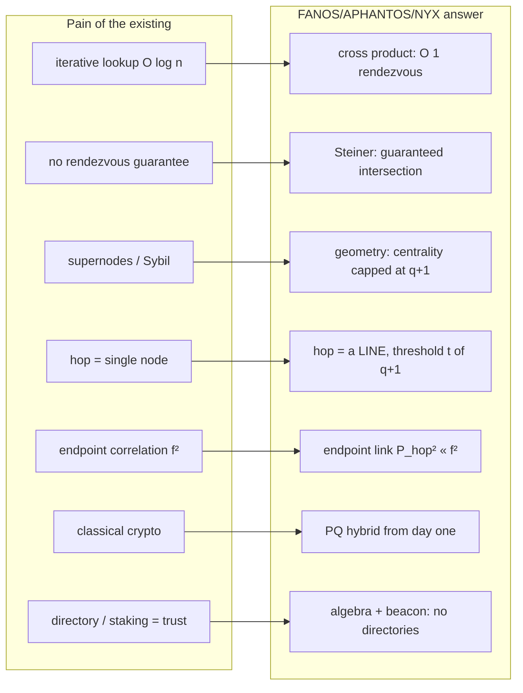
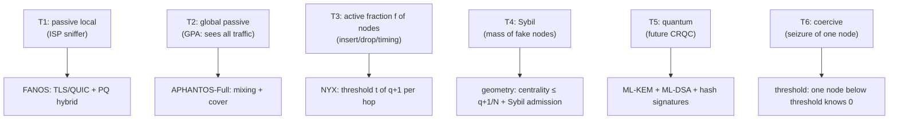
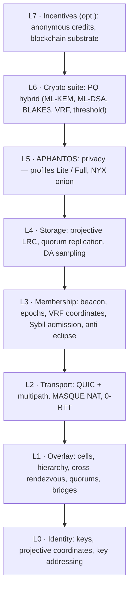
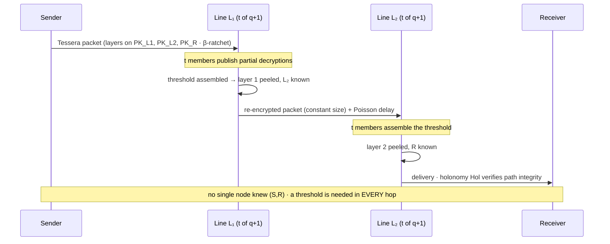
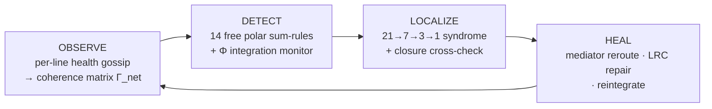
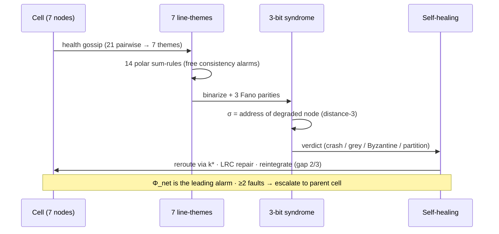
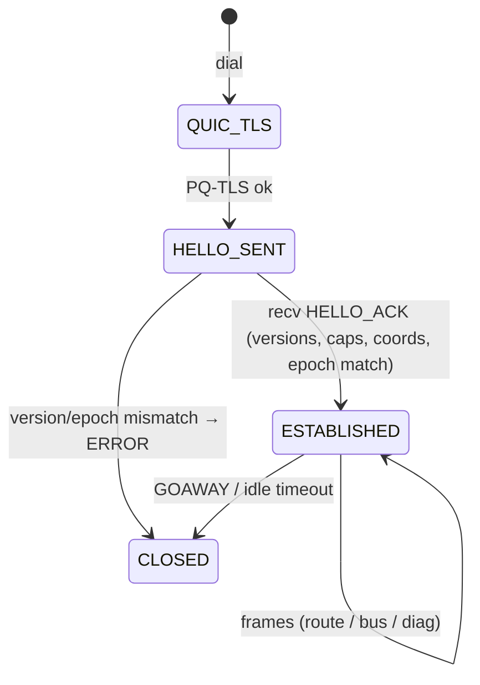
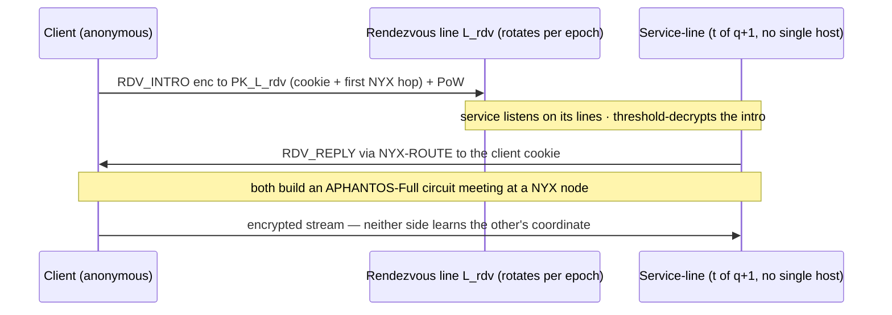

# FANOS

> *"Structure lives not in pairs but in triples. A network that knows this does not search — it computes."*
> — the working third-order principle (UHM)

:::info Document status
**Version 0.1** (reference architecture). Result statuses use the corpus discipline **[T]** / **[C]** / **[H]** / **[P]** (see the block below). **Origin:** UHM, Discovery 7 (projectively-structured distributed system) + the Serre bundle ([gap-thermodynamics](/docs/core/dynamics/gap-thermodynamics)) + the Σ-calculus (Steiner/Steane). **License** (intended open): CERN-OHL-S v2 (hardware profiles) + Apache-2.0/MIT (code) + CC-BY-SA (document). **Interactive:** [live Fano plane and security calculator](pathname:///fanos/fanos-playground.html) (a site page, works offline). **Verifier:** [`/fanos/fanos_verify.py`](pathname:///fanos/fanos_verify.py).
:::

## Naming and the thematic triad

The protocol is named after the Greek root **φαν-** ("to bring to light, to appear"), the same root that gives us the word *phenomenon* (that which appears) and the surname of Gino **Fano** — author of the finite projective plane PG(2,2) that underlies the whole construction. Three components form a "light — invisible — night" triad of *function*; a fourth, **DIAKRISIS**, is the *reflexive* faculty — the cell observing itself:

| Component | Greek root | Meaning | Role in the protocol |
|---|---|---|---|
| **FANOS** | φανός | "lantern, beacon; the manifest" | Base public protocol: addressing, routing, storage, quorums |
| **APHANTOS** | ἄφαντος | "invisible, vanished" | Optional anonymity layer (mixnet-class) |
| **NYX** | Νύξ | "Night" (goddess of concealment) | Threshold sheaf onion routing inside APHANTOS |
| **DIAKRISIS** | διάκρισις | "discernment; separating true from false" | Self-diagnosis and self-healing under node/segment failure (Part VI) |
| **CALYPSO** | Καλυψώ | "the concealer" (the nymph who hid Odysseus) | Anonymous hidden services with no directory and no single host (Part XII) |
| **PROTEUS** | Πρωτεύς | "the shape-shifter" (the god who changes form to escape capture) | Optional polymorphic transport / censorship & DPI resistance (Part XIII) |

The public layer "shines" (routes are verifiable and efficient); with APHANTOS enabled, traffic "vanishes" into structurally-balanced noise; NYX realises concealment as a composable sequence of threshold groups. DIAKRISIS is named for a *faculty*, not a lighting condition, because it is not one more way to route — it is the network turning its gaze on itself: after NYX hides the traffic, DIAKRISIS is what still tells a healthy cell from a corrupted one, a crash from a lie, churn from a partition. It shares its name with the corpus discernment theory *Diakrisis* (διάκρισις, the distinguishing of the genuine) deliberately: fault diagnosis *is* discernment, carried out on the same seven-fold structure.

---

## Contents

- **Part I.** Motivation: what is broken in Kademlia, Tor, Nym, Lokinet
- **Part II.** Mathematical foundation: PG(2,q), Steiner, cross product, PSL/PGL, codes, the coherence matrix, the third-order principle
- **Part III.** System model, threat model, and failure model
- **Part IV.** Architecture: layers L0–L7
- **Part V.** NYX — the evolution of onion routing (a core of the novelty)
- **Part VI.** DIAKRISIS — self-diagnosis under node and segment failures (a core of the novelty)
- **Part VII.** Wire protocol, data formats, and interoperability (implement in any language)
- **Part VIII.** Security analysis (quantitative) + red-team pass across all layers
- **Part IX.** Performance (quantitative)
- **Part X.** Applications: blockchain / mixnet / VPN
- **Part XI.** Implementation, integration surfaces (API / SOCKS5 / VPN / embedded), and portability
- **Part XII.** CALYPSO — anonymous hidden services
- **Part XIII.** PROTEUS — polymorphic transport and censorship resistance (optional, configurable)
- **Part XIV.** Comparison with existing protocols
- **Part XV.** Roadmap
- **Part XVI.** Limitations and open problems (honest)
- **Part XVII.** Connection to the UHM corpus
- **Part XVIII.** The distributed-cognition synthesis: UHM → SYNARC → FANOS
- **Appendices:** glossary, pseudocode, test vectors, interactive

:::note Status discipline
As in the main UHM corpus, every nontrivial claim is tagged: **[T]** — theorem (rigorously proven, often verified by computation); **[C]** — conditional (true under an explicitly named assumption); **[H]** — hypothesis (formulated, needs proof/audit); **[P]** — program (a direction of work). Cryptographic honesty: **the novelty of FANOS is the architectural composition of vetted primitives, not new hardness assumptions.** The single genuinely new construction (the NYX threshold-sheaf Tessera packet, §V) is tagged **[P]** — it needs formal cryptanalysis before production. We do NOT invent new mathematical hardness "from scratch": that would be irresponsible for a real-world protocol.
:::

Every quantitative claim in this document is reproduced by the verifier [`/fanos/fanos_verify.py`](pathname:///fanos/fanos_verify.py) (V1–V10: projective geometry, quorums, the security curve, scaling; **V11–V22: DIAKRISIS self-diagnosis, the collective-subject window, multi-fault resolution, and PROTEUS censorship resistance** — first-order blindness, the mediator map, syndrome localization, partition-resistance, the coherence-matrix health metrics, the `1/9` integration budget, the leading-indicator containment, the collective-subject window (V19), and multi-fault resolution — crashes to 3, Byzantine to 2 (V20–V21), and moving-target bridges vs a censor (V22)). The numbers in the tables are computed, not illustrative.

---

# Part I. Motivation: what is broken

:::tip Orientation
Before building the new, let us name the pain of existing systems concretely. Three protocol families — distributed hash tables (DHT), onion networks (Tor/Lokinet), mixnets (Nym) — each solved one problem at the cost of another. FANOS takes projective geometry as a single foundation that lifts several trade-offs at once.
:::

## 1.1 Distributed hash tables (Kademlia, Chord)

Kademlia is the backbone of BitTorrent, IPFS, Ethereum discovery, libp2p. What hurts:

- **Iterative O(log n) lookup with many round trips.** Each lookup is a chain of "who is closer to the key" queries, one round per step. At n=10⁹ that is ~30 sequential network exchanges.
- **No intersection guarantee.** Two nodes searching "nearby" are not required to meet at a deterministic point — rendezvous is probabilistic.
- **Hot spots and supernodes.** Load distribution is statistical; a node can accumulate disproportionate centrality (eclipse attacks, Sybil dominance in a key region).
- **Fragility to Sybil.** Control of a region of identifiers grants control of routes to the corresponding keys.

## 1.2 Onion routing (Tor, Lokinet)

- **Endpoint correlation [known weakness].** A global passive observer, or an adversary owning a fraction *f* of relays, links the entry and exit of a circuit with probability ≈ *f²* (owns guard and exit). For *f*=0.2 that is ≈ 4% per circuit — and it accumulates with rotation.
- **A single relay = a single point of compromise.** A compromised node immediately reveals the neighbouring hops of its segment.
- **Classical cryptography.** Tor is historically not post-quantum; recording traffic today → decrypting tomorrow ("harvest now, decrypt later").
- **Centralised directory authorities** (Tor) or a **staking registry** (Lokinet/Oxen) as a point of trust/attack.
- **Path predictability.** The circuit is fixed at setup; guard discovery is a real deanonymisation vector.

## 1.3 Mixnets (Nym / Loopix)

Nym is the strongest practical anonymity today (resistance to a global observer via statistical mixing + cover traffic). What can be improved:

- **Trust in mixing is statistical, not verifiable.** The client gets no *cryptographic* proof that a mix actually mixed (it relies on Poisson delays + economic incentives).
- **A hop = a single mix node.** As in Tor, compromise of a node reveals its local linkage (mixing masks timing, but not structure if the node honestly logs input–output).
- **Stratification is set by ad-hoc VRF weights.** Uniformity of path selection is a matter of configuration, not a structural theorem.
- **Sybil resistance via staking** binds identity to capital.

## 1.4 What FANOS offers (summary)



---

# Part II. Mathematical foundation

:::tip Orientation
FANOS is a direct engineering consequence of the UHM finding that the specific structure of the seven is invisible to pairwise statistics and fully revealed only starting from triples (the third-order principle). In a network this translates as: **do not link nodes pairwise — organise them into the triples/lines of a projective plane.** Below is all the apparatus needed, with verified properties.
:::

## 2.1 The finite projective plane PG(2,q)

Take a finite field GF(q) (q a prime power). The illustrative cells below use prime fields GF(p) at q ∈ {2, 7, 13, 31}; the default binary profile takes q = 2^m (field GF(2^m)) for arithmetic bit efficiency. The **points** of the plane are one-dimensional subspaces of GF(q)³, i.e. nonzero coordinate triples `[x:y:z]` up to scaling. The **lines** are two-dimensional subspaces, also given by triples `[a:b:c]`. The "point on line" incidence is the vanishing of the dot product: `ax+by+cz = 0`. Self-duality: points and lines are interchangeable.

**Base parameters [T]** (verified, `fanos_verify.py` V1):

| q | N = points = lines | points per line (q+1) | lines per point (q+1) | collineation group \|PGL(3,q)\| |
|---:|---:|---:|---:|---:|
| 2 | 7 | 3 | 3 | 168 |
| 7 | 57 | 8 | 8 | 5 630 688 |
| 13 | 183 | 14 | 14 | 810 534 816 |
| 31 | 993 | 32 | 32 | 851 974 934 400 |

General formula: **N = q² + q + 1**, line size = q+1, lines through a point = q+1.

## 2.2 Three load-bearing properties

**Steiner property S(2,3,q) [T].** Any two points lie on exactly one common line. At q=2 this is precisely the Steiner triple system S(2,3,7) — the UHM Fano plane (21 pairs covered by 7 lines once each, verified earlier).

**Dual property (Maekawa quorums) [T].** Any two lines intersect in exactly one point (verified V1 for q≤31). Hence a **quorum system**: a line = a quorum of size q+1 ≈ √N; any two quorums intersect. This is Maekawa's classic result (1985) on O(√N) mutual exclusion; FANOS reuses it for consensus and replication.

**Cross product = join and meet [T].** The line through two points u, v is their vector cross product `u × v` in GF(q)³; the intersection point of two lines is also their cross product. The identity `(u×v)·u = 0` holds over any commutative ring. **Consequence for the network: rendezvous is a single field operation, with no search at all** (verified V2, test vector in PG(2,7): `[1:0:0] × [0:1:0] = [0:0:1]`, both points on the line; the bridge of the two lines recovers `[1:0:0]`).

<details>
<summary><b>Why this is deeper than "convenient addressing" (expand)</b></summary>

The collinearity graph of a projective plane is **complete**: every pair of points is joined (lies on a common line). Therefore the "distance" between nodes is not the number of hops but the *structure of shared groups*: N nodes, but only N ≈ q² lines, each node in q+1 ≈ √N lines, and any two lines intersect. This is not a "who is connected to whom" topology but a "who belongs to which quorum" topology — and the quorums are arranged so that intersections are guaranteed by algebra. Exactly this removes the need for a DHT: the answer to "who is responsible for key k", "which group do u and v share", "who bridges groups A and B" is computed, not searched.
</details>

## 2.3 The automorphism group and uniformity

The collineations of PG(2,q) form the group PGL(3,q) (for prime q; in general PΓL(3,q)). At q=2 this is PGL(3,2) ≅ PSL(2,7) of order **168** — the very UHM group Aut(Fano). The group acts **2-transitively** on points: any ordered pair can be mapped to any other. Engineering consequence: **all nodes are structurally equivalent, all paths are symmetric** — uniformity of path distribution is a theorem about transitivity, not the result of weight-tuning (unlike Nym).

## 2.4 Innate error-correcting codes

The smallest cell q=2 — the Fano plane — **coincides** with the Hamming(7,4) code: 16 codewords, exactly 7 words of weight 3 = the 7 Fano lines (verified V10, and earlier in `uhm_discoveries.py` S6). The Steane quantum code = CSS(Hamming, Hamming), distance 3. Hence:

- **[T]** any FANOS cell carries innate syndrome diagnostics (the Σ-calculus pyramid of the corpus: 21 links → 7 line-checks → 3 syndrome bits → 1 verdict);
- **[T]** the projective plane yields a locally recoverable code (LRC): a lost node (point) is recovered from any of its q+1 lines. Locality r = q reads, number of independent repair groups = q+1, redundancy ≈ (q+1)/q (verified V9: for q=31 this is 1.032×).

## 2.5 The third-order principle and the mediator map (import from UHM)

The key finding that sets the whole philosophy of the protocol (verified by orbit enumeration, `uhm_discoveries.py` S2–S4):

> Under Aut, the orbit of **pairs** is single (21 pairs equivalent ⇒ pairwise statistics does NOT see structure); there are two orbits of **triples** (7 lines vs 28 non-lines ⇒ structure is first distinguishable on triples).

In a network this means: **to link nodes pairwise is to work in the layer where the projective structure is invisible.** All FANOS advantages live at the level of triples and lines. The mediator map (every pair has a unique "mediator" — the third point of its line, `k*(i,j)`) translates into **deterministic routing-repair**: a path (i→j), when its direct channel fails, is regenerated only through `k* = ` the third point of their common line — a fallback with no routing tables.

## 2.6 The Serre bundle and holonomy (foundation for NYX)

From `gap-thermodynamics.md` (Theorem 1.1 [T]): the space of maps carries the structure of a **Serre bundle** with base the external observables and fibre the internal phases, and traversing a closed contour yields **holonomy** `Hol(C) = P·exp(∮ A)` — a nontrivial geometric phase shift (analogue of the Berry phase). NYX (Part V) uses this literally: the key ratchet of the onion is indexed by the connection on the incidence bundle, and the path holonomy serves as a compact self-authenticator of the route.

## 2.7 The network's coherence matrix and its live measures {#coherence-matrix}

:::tip Orientation
Everything so far used the *combinatorics* of the plane (points, lines, quorums). UHM offers one more object that existing overlays have no analogue of: the plane's **coherence matrix** Γ — a small dense operator whose scalar invariants are live health readings of the cell. This subsection defines it and its three measures; Part VI (DIAKRISIS) turns them into a self-diagnosis system. This is the concrete answer to "what does the coherence-matrix paradigm buy a network".
:::

A cell of `N = q²+q+1` nodes is not only a set of quorums; at runtime it has **behaviour**. Let `a_i(t)` be node `i`'s activity signal over a monitoring window (bytes relayed, liveness, load — any per-node observable). The `N × N` sample **correlation matrix** `C` of these signals is symmetric positive-semidefinite with unit diagonal; its trace-normalised form

```
Γ_net = C / N          (Hermitian, PSD, Tr Γ_net = 1)
```

is a bona fide **coherence matrix** in `D(ℂ^N)` — exactly the object the UHM corpus studies. For the base cell `q=2` this is literally a `7 × 7` Γ over the seven sectors `A,S,D,L,E,O,U` ([coherence matrix](/docs/core/structure/dimension-u#мера-интеграции-φ)). A FANOS cell therefore *is* a Holon in the corpus sense, and inherits its three scalar invariants:

| Measure | Formula on `Γ_net` | Reads out | Threshold |
|---|---|---|---|
| **Integration** `Φ` | `Σ_{i≠j}|γ_ij|² / Σ_i γ_ii²` ([Φ [Т]](/docs/core/structure/dimension-u#мера-интеграции-φ)) | how much the cell is "more than its parts" (cross-node binding) | `Φ_th = 1` (T-129 [Т]) |
| **Structuredness** `P` | `Tr(Γ_net²)` (purity) | how far the cell is from a formless uniform mesh | `P_crit = 2/7` [Т] |
| **Reflection** `R` | `1/(7P)` (canonical: proximity to `I/7`) | self-model sufficiency; threshold = share of cycles spent on self-observation | `R_th = 1/3` [Т] |

**The systemic-correlation threshold `r* = 1/√6 ≈ 0.408` [Т]** (numbers are for the base 7-cell `q=2`; at general `N` the thresholds scale as `r* = 1/√(N−1)`, `P_crit = 2/N`)**.** On the equicorrelated stratum — all off-diagonal correlations equal to a mean `r` — the measures collapse to closed form (verified `fanos_verify.py` V15):

```
Φ_net = 6r²,     P_net = (1 + 6r²)/7,     Φ = 7P − 1.
```

Hence `Φ = 1 ⟺ P = 2/7 ⟺ r = 1/√6`: the integration and structure thresholds coincide at a **single critical mean correlation**. This is a phase line for the whole cell:

- **`r < 1/√6` (Φ < 1): diversified / resilient.** Node behaviours are weakly coupled; the cell is *pre-integrative*. A local failure stays local — diversification "works", no single trigger cascades.
- **`r > 1/√6` (Φ > 1): systemic.** The cell "moves as one subject": behaviours are strongly coupled, so a single perturbation propagates cell-wide. This is precisely the **cascade-failure regime**, and it is detectable *before* any node has failed — from the correlation structure alone.

This is Discovery 9 of the UHM engineering catalogue (systemic risk of an equicorrelated 7-portfolio) redeployed as a **reliability early-warning**: a monitor that watches mean behavioural correlation crossing `0.408` sees an incipient cascade a full regime ahead of any liveness alarm. No DHT or onion overlay exposes such a quantity, because none carries a coherence matrix.

:::note Why this is not available to Kademlia/Tor
Their state is a routing table — a *graph*, whose only spectral invariant is connectivity. A coherence matrix is a *density operator*: it has purity, integration, a self-model, and a critical correlation. The third-order principle (§2.5, §2.8) is what makes these invariants meaningful — they read the triple-structure the graph cannot see.
:::

## 2.8 The third-order principle, sharpened: first-order blindness [Т] {#third-order-blindness}

Section 2.5 asserted that pairwise statistics cannot see the plane's structure. Here is the exact theorem, because DIAKRISIS (Part VI) depends on it: **the reason a heartbeat mesh diagnoses so poorly is that it is provably Fano-blind.**

**First-order blindness [Т]** (verified V11, and canonically the linear layer of the [Fano fingerprint](/docs/applied/research/fano-fingerprint)). Sum the adjacency matrices of the seven Fano lines. The result is exactly

```
Σ_p A(line_p) = J − I        (J = all-ones, I = identity),
```

whose spectrum is that of the complete graph `K₇`: one eigenvalue `6`, and `−1` with multiplicity six. **Any equal-weight pairwise statistic built from the lines is therefore indistinguishable from unstructured full connectivity.** A ping/heartbeat mesh — the monitoring backbone of every existing overlay — lives in exactly this blind layer: it can tell you *that* a link is up or down, but the seven's structure (which triples are lines, who mediates whom, where a lie is hiding) is spectrally invisible to it.

The structure first appears at **third order** (orbit of pairs is single; two orbits of triples — 7 lines vs 28 non-lines, §2.5). Consequences for monitoring, made precise in Part VI:

- **Detection** of the faults that matter (equivocation, grey failure) must read *triples*, not pairs — via the polar sum-rules of [T-226](/docs/applied/research/fano-fingerprint#t-226) and the closure-law cross-checks of §2.5.
- **Localization** rides the Σ-compression pyramid `21 → 7 → 3 → 1` of [T-225](/docs/applied/research/syndrome-calculus#t-225): 21 pairwise readings collapse to 7 line-themes, to a 3-bit syndrome, to a 1-bit verdict.
- **Intervention** (repair, reroute) works through the **mediator** `k*(i,j)` — the corpus **polar point** `π(i,j)`, the third point of the pair's line, with the octonionic sign `e_i·e_j = ±e_{π(i,j)}` ([T-226 §2](/docs/applied/research/fano-fingerprint#полярное-разбиение)).

---

# Part III. System model and threat model

## 3.1 Entities

| Entity | Definition |
|---|---|
| **Node (point)** | A participant with a key pair; the coordinate `[x:y:z] ∈ PG(2,q)` is assigned by a VRF of the public key |
| **Line (quorum/bus)** | A group of q+1 nodes; carries a multicast bus, a quorum vote, a threshold group |
| **Cell** | One plane PG(2,q), N = q²+q+1 nodes; the unit of locality |
| **Hierarchy** | Recursive composition of cells; a cell = a "point" of the parent cell |
| **Epoch** | An interval over which the randomness beacon and coordinate assignment are fixed; a reshuffle happens at the end |
| **Beacon** | A threshold source of public unpredictable randomness (drand-class) |

## 3.2 Threat model (adversary profiles)



**Key security assumptions** (stated explicitly so the numbers of §VIII are honest):

1. Coordinate assignment is VRF-verifiable and not cheaply grindable (§4.0) ⇒ an adversary with a fraction *f* of nodes ends up as ≈ a fraction *f* of every line (random placement). **[C]** under a working Sybil admission.
2. The adversary cannot predict the epoch reshuffle (the beacon is unpredictable) ⇒ cannot "pre-settle" into a target line.
3. The threshold t is chosen so that it cannot be broken without owning ≥ t members of a line.

## 3.3 Failure model (what DIAKRISIS must diagnose) {#failure-model}

Security (an adversary *choosing* to harm) and reliability (components *failing*) are different axes; §3.2 covered the first, this covers the second. A live cell must survive and self-diagnose the following, which Part VI addresses point by point:

| Failure | What happens | First-order visible? | DIAKRISIS handle |
|---|---|---|---|
| **Crash / churn** | a node stops responding | **yes** (heartbeat times out) | line-local liveness; LRC repair (§6.8) |
| **Grey / degraded** | a node answers but slowly/lossily | partly (rate drift) | polar-rate sum-rules, T-226 (§6.3) |
| **Byzantine / equivocation** | a node is *up* but corrupts or misroutes and lies about it | **no** — pairwise-healthy | third-order closure cross-check (§6.5) |
| **Eclipse** | a node's neighbourhood is captured to isolate it | structurally bounded | anti-eclipse: all q+1 lines must fall (§6.6) |
| **Partition / segment loss** | a whole line/sub-cell drops or splits | via connectivity | partition-resistance theorem + Φ monitor (§6.6) |

The load-bearing observation is the **Byzantine row**: a node that keeps its heartbeats green while corrupting traffic is *invisible to first-order monitoring* (§2.8). Diagnosing it is not an add-on — it is the reason the diagnostic plane must be third-order. Two honesty caveats carried into §6:

1. Crash and partition are first-order-detectable; the geometry buys *localization and repair*, not detection, for these.
2. Localization is stratified (§6.3): crashes recover up to **three** per cell (LRC peeling; first failure is a hyperoval), the 7-theme layer pins **two** Byzantine faults exactly, and only ≥3 Byzantine (or a hyperoval crash) escalate to the parent.

---

# Part IV. Architecture: layers L0–L7



:::note DIAKRISIS is a plane, not a layer
The eight layers L0–L7 are the *forward* stack (how a message gets built, routed, hidden, delivered). Self-diagnosis (Part VI, DIAKRISIS) is orthogonal to all of them: it reads the health of L1 (overlay), L3 (membership), L4 (storage) and L5 (privacy) through one reflexive loop, using the same projective structure those layers route on. Think of L0–L7 as the body and DIAKRISIS as the proprioception — the sense by which the network feels its own state. It is drawn as a cross-cutting plane rather than a layer for exactly that reason.
:::

## L0. Identity and addressing

- **Key pair:** hybrid Ed25519 + ML-DSA-65 (signature), X25519 + ML-KEM-768 (KEM). The long-term identifier = hash of the bundle of public keys.
- **Node coordinate:** `coord = MapToPoint( VRF_beacon(pubkey, epoch) )` — the VRF binds the point to the epoch, with a reshuffle at epoch change. `MapToPoint` is a uniform map of the 256-bit output into `[x:y:z] ∈ PG(2,q)` (discard the zero vector, normalise the first nonzero to 1).
- **Content addressing:** a resource key `k` maps to a point `MapToPoint(H(k))`; the responsible node is the nearest occupied point (consistent hashing on projective coordinates). Replicas are the q+1 nodes of the lines through that point (LRC, L4).

## L1. Overlay and routing

**Rendezvous [T, O(1)].** To reach u→v: both sides lie on the unique line `L = u × v`; the sender posts to bus L, the receiver listens on all of its q+1 buses. No search.

**Bridge between groups [T, O(1)].** Two buses `L₁, L₂` intersect in the unique node `p = L₁ × L₂` — a deterministic, load-balanced gateway. Multicast aggregation trees are algebraically predetermined.

**Hierarchy (scale) [T].** One plane holds N=q²+q+1 nodes; for internet scale — a recursion of cells (verified V4):

| cell q | N_cell | levels k | total nodes | state ≈ k·N | rendezvous depth |
|---:|---:|---:|---:|---:|---:|
| 31 | 993 | 2 | 986 049 | 1 986 | 2 |
| 31 | 993 | 3 | 979 146 657 | 2 979 | 3 |
| 127 | 16 257 | 2 | 264 290 049 | 32 514 | 2 |
| 127 | 16 257 | 3 | **4 296 563 326 593** | 48 771 | 3 |

:::warning Honesty of scaling
We do **not** claim O(√n) routing state for a single plane — the collinearity graph is complete, and in one plane a node structurally "sees everyone". Scale is achieved by a **hierarchy of cells**: state/depth asymptotics are O(log n), like Kademlia. The FANOS win is not in the hop asymptotics but in: (1) deterministic rendezvous in 1 message per level (no iterative probing, fewer RTTs in practice); (2) guaranteed quorum intersection (consensus/replication "for free"); (3) structural balance and a centrality cap (anti-Sybil); (4) free multipath (q+1 paths); (5) LRC-optimal storage. These advantages are real even at DHT-equal asymptotics.
:::

## L2. Transport

- **QUIC (RFC 9000/9001)** in userspace: 0-RTT resumption, built-in encryption, stream multiplexing without head-of-line blocking.
- **Multipath QUIC:** q+1 near-disjoint paths between cells (members of a common line) → bandwidth aggregation and instant failover.
- **MASQUE (RFC 9298)** for proxying/NAT traversal; ICE-like hole-punching through bridge nodes.
- **PROTEUS (optional, Part XIII):** under censorship the plain QUIC wire is swapped for a polymorphic obfuscated transport (DPI/blocking resistance). Off by default; orthogonal to the overlay above.
- **Fully userspace, no kernel** ⇒ multiplatform (Part XI).

## L3. Membership, epochs, beacon, Sybil admission

- **Randomness beacon [T under threshold BLS]:** drand-class, honest-majority threshold across "anchor" lines; emits a public unpredictable seed per epoch. A post-quantum variant is [P] (hash/lattice VRF beacons — an active direction).
- **Epoch reshuffle:** coordinates are recomputed by a VRF of the new seed ⇒ the adversary cannot pre-occupy a target line (defence against path prediction and guard discovery).
- **Sybil admission (pluggable):** three profiles — (a) **PoW admission** (memory-hard, for open networks); (b) **stake/bond** (for the blockchain overlay); (c) **web-of-trust** (for federations). Independently of the profile, a structural cap operates:
- **Structural centrality cap [T]** (verified V3): every node is on exactly q+1 of N lines = a fixed fraction (q=31 → 3.22%). **Centrality cannot be "bought"** — line membership is fixed by coordinates. Sybil nodes do not become supernodes.
- **Anti-eclipse:** q+1 independent lines per node ⇒ to isolate a node one must control all its q+1 lines simultaneously.

## L4. Storage and replication

- **Projective LRC [T]:** a point's data is erasure-coded across its q+1 lines; a lost node is recovered from any single line (locality q, availability q+1). Redundancy (q+1)/q → 1 as q grows.
- **Quorum consistency [T]:** write to a quorum-line W, read from a quorum-line R; `W ∩ R ≠ ∅` is guaranteed (Maekawa) ⇒ linearisability with no separate coordinator.
- **DA sampling (data availability):** for the blockchain overlay — sampled availability checks along lines (each line = a sample); Steiner guarantees coverage.

## L5. APHANTOS (overview; detail in Part V)

Three profiles on **one** substrate (switching = a "dial" of latency/anonymity):

| Profile | Hop | Latency | Security class | Analogue |
|---|---|---|---|---|
| **FANOS-Direct** | open | minimum | no anonymity | libp2p/QUIC |
| **APHANTOS-Lite** | single node (Sphinx-class), PQ | low | ≈ Tor, but PQ + unpredictable epochs + balanced cover | Tor/Lokinet |
| **APHANTOS-Full** | **a line (threshold t of q+1)** + verifiable mixing + Poisson delays | tunable | > Nym (threshold + verifiability + algebraic rendezvous) | Nym/Loopix |

## L6. Cryptographic suite

:::note Principle
All primitives are **vetted and post-quantum/hybrid**. The novelty is in the composition, not the hardness.
:::

| Purpose | Primitive | Status |
|---|---|---|
| KEM (key exchange) | X25519 **+** ML-KEM-768 (hybrid, KDF combiner SHAKE256) | standard/PQ |
| Signature | Ed25519 **+** ML-DSA-65; conservative opt. SLH-DSA (SPHINCS+) | standard/PQ |
| AEAD | ChaCha20-Poly1305 (portability) / AES-256-GCM (HW) | standard |
| Hash/XOF | BLAKE3 (speed) + SHAKE256 (PQ-KDF) | standard |
| VRF | ECVRF-Edwards25519 (RFC 9381); PQ-VRF | standard / [P] |
| Beacon | threshold BLS (drand); PQ beacon | standard / [P] |
| Threshold sharing | Shamir SSS + Feldman/Pedersen VSS; DKG (GJKR) | standard |
| Threshold decryption | threshold KEM/ElGamal, non-interactive share combination | standard |
| Verifiable shuffle | Bayer–Groth argument (classical); PQ shuffle | standard / [P] |
| Anonymous credits | VOPRF Privacy Pass (RFC 9578) / BBS+ | standard |
| Packet | Tessera (Sphinx-derived, threshold, PQ) | **[P] needs audit** |

## L7. Incentives (optional)

- **Anonymous relay credits:** blind tokens (Privacy Pass VOPRF) ⇒ payment does not deanonymise (unlike staking, which binds identity to capital).
- **Blockchain substrate:** see Part X — quorum-lines as validator committees with guaranteed intersection.

---

# Part V. NYX — the evolution of onion routing

:::tip Orientation
This is the core of the novelty and the direct answer to "design a more advanced form of onion routing, informed by the fundamental research". The classical onion (Tor) wraps a message in L layers of encryption along a path of *single* nodes. NYX changes three things at once: (1) a hop is not a node but a **line** (a threshold group); (2) a path is not a random chain but a **geometric flag** of incident point–line pairs, uniform by the transitivity theorem; (3) forward secrecy is provided by a **holonomic ratchet** on the Serre bundle, not only by per-hop keys. Below, in order.
:::

## 5.1 The classical onion and its limits

In Tor a message M is encrypted layer by layer with the hop keys `H₁…H_L`: `E₁(E₂(…E_L(M)))`. Each relay peels its layer, learns the previous and next hop. Limits (Part I): a single node = a point of compromise; endpoint correlation f²; a fixed predictable path; classical crypto; directories.

## 5.2 NYX innovation 1 — the threshold sheaf layer

**Idea.** Each onion layer is peeled not by a single node but by a **threshold t of q+1** members of a line. No single node can peel a layer alone (below threshold it knows *nothing*). The term "sheaf" is doubly apt: it is both a mathematical sheaf over the line and the "splitting" of a message, like light through a prism.

**Mechanism.** At cell formation the members of each line run a DKG (distributed key generation, GJKR) ⇒ the line has a public key `PK_L` and each member holds a share of the secret `sk_i` (Shamir). The sender encrypts a layer to `PK_L`. To peel a layer, ≥ t members publish partial decryptions that are non-interactively combined (a threshold KEM). The routing information "where next" is revealed only when the threshold is reached.

**What it buys [T, curve computed]:** an adversary owning a fraction *f* of nodes (randomly placed) breaks one hop with probability `P_hop = P(Binom(q+1, f) ≥ t)` — a binomial tail. Endpoint linkage (like Tor's guard+exit) requires breaking the first AND last hop: `P_link = P_hop²`.

**Security curve** (verified V5; compared with Tor's `f²`):

| line q+1 | threshold t | f=0.10 | f=0.20 | f=0.30 | f=0.50 |
|---:|---:|---:|---:|---:|---:|
| 8 | 6 | 5.5·10⁻¹⁰ | 1.5·10⁻⁶ | 1.3·10⁻⁴ | 2.1·10⁻² |
| 8 | 7 | 5.3·10⁻¹³ | 7.1·10⁻⁹ | 1.7·10⁻⁶ | 1.2·10⁻³ |
| 14 | 10 | 4.7·10⁻¹⁵ | 2.1·10⁻⁹ | 2.8·10⁻⁶ | 8.1·10⁻³ |
| 32 | 22 | 5.6·10⁻³⁰ | 1.1·10⁻¹⁷ | 4.9·10⁻¹¹ | 6.3·10⁻⁴ |
| **Tor (f²)** | — | 1.0·10⁻² | 4.0·10⁻² | 9.0·10⁻² | 2.5·10⁻¹ |

**Advantage over Tor** at f=0.2: for (q+1=8, t=6) — **×26,000**; for (q+1=14, t=10) — **×18,800,000**. Full tracing of all L hops is even steeper — `P_hop^L`: for (8,6), f=0.2, L=3 → **1.9·10⁻⁹** (Tor ≈ 0.04).

:::note The price of the threshold — availability and latency
The threshold t requires t honest members online (availability is the binomial-complement problem) and one round of partial-decryption combination per hop. Therefore the threshold profile is **APHANTOS-Full** (high security, higher latency); for low-latency scenarios there is **APHANTOS-Lite** (single node, Sphinx-class). The dial λ (§5.5) interpolates continuously.
:::

## 5.3 NYX innovation 2 — a geometric path (flag), not a random chain

**Idea.** A NYX path is a sequence of incident point–line pairs (in projective geometry — a **flag**): `p₀ ∈ L₁ ∋ p₁ ∈ L₂ ∋ p₂ …`. Adjacent lines intersect (always, by the dual Steiner), and the intersection point is the relaying node. Since **PGL(3,q) acts transitively on flags [T]**, the path distribution is *provably uniform*, and the client can verify it by algebra — without relying on the honesty of VRF weights (Nym's problem).

**Against intersection attacks:** the unpredictable epoch reshuffle (L3) means the set of admissible lines for the next epoch is unknown in advance ⇒ long-term path targeting is impossible.

## 5.4 NYX innovation 3 — the holonomic ratchet (import of the Serre bundle)

**Idea.** On the incidence bundle (base — points/observable, fibre — phases; §2.6) a connection `A` is defined. At each hop a key transform (blinding, as in Sphinx) is applied, but **derived from the incidence connection**: the hop factor `β_k = KDF(A(p_{k-1}, p_k))`. The composition along the path is the ordered product = **holonomy** `Hol = P·∏ β_k`.

**What it buys:**
- **Forward secrecy without extra RTTs [C]:** the ratchet is one-way (a KDF chain), compromise of the current hop does not reveal past ones.
- **A compact path authenticator [H]:** both endpoints, knowing the algebraic description of the path, compute the same `Hol`; intermediate nodes see only the local `β_k`. `Hol` serves as a self-verifying "route signature" — inserting/substituting a hop breaks the holonomy (just as a nontrivial `Hol(C) ≠ 1` signals an incorrect contour traversal in gap theory).
- **A shared apparatus with the physics corpus:** this is the same object as the Berry phase in `gap-thermodynamics.md` — the network inherits the theory's machinery.

:::warning Status of the holonomic ratchet
Mechanically the ratchet reduces to a geometry-organised chain of Diffie-Hellman-like blinding factors (as in Sphinx), which grounds forward secrecy and path integrity. However, **a rigorous cryptographic formalisation (model, reduction, a PQ version of the blinding) is [P]**: a formal analysis is needed before production. We honestly mark this as a research construction, not as ready-proven security.
:::

## 5.5 NYX innovation 4 — structurally-balanced cover traffic and the λ dial

- **Cover traffic [T uniformity]:** every node emits a constant stream of cover on each of its q+1 lines. By the plane's regularity the load is **identical** across all nodes ⇒ zero volume fingerprint. This is a theorem about point-regularity, not a policy (verified V8).
- **Poisson mixing (Loopix-class):** exponential delays with mean 1/μ per hop; mean path latency = L/μ; the anonymity set size ≈ packets in the mixing window (Little's law). The μ dial leads continuously from "Tor-class" to "Nym+":

| μ (1/s) | L hops | arrival (1/s) | mean latency | anonymity set | entropy |
|---:|---:|---:|---:|---:|---:|
| 2.0 | 3 | 50 | 1.5 s | ~25 | ~4.6 bits |
| 1.0 | 3 | 50 | 3.0 s | ~50 | ~5.6 bits |
| 0.5 | 5 | 200 | 10 s | ~400 | ~8.6 bits |
| 0.2 | 5 | 1000 | 25 s | ~5000 | ~12.3 bits |

(verified V7). One substrate, one codebase — security/latency is set by a parameter.

## 5.6 NYX innovation 5 — algebraic private rendezvous (a replacement for hidden services)

**The problem of Tor onion services / Lokinet:** separate infrastructure of introduction points and rendezvous points, plus HSDir — known deanonymisation vectors.

**The NYX solution [H→C]:** two parties sharing a secret `s` (from a previous contact or a PAKE) deterministically derive a common **meeting line** `L_rdv = MapToLine( VRF_beacon(s, epoch) )` and meet on it — with no directory, no introduction points. The line rotates each epoch together with the beacon ⇒ no long-term target for attack. The initiator posts a request encrypted to `PK_{L_rdv}`; the responder, listening on its lines, replies. Anonymity of both parties is protected by the threshold layer of the same line.

## 5.7 The Tessera packet (summary; wire format in §VII)

Fixed size (indistinguishability), Sphinx-derived, with two extensions: a **PQ-hybrid** header (X25519+ML-KEM per hop) and **threshold addressing** of a layer (encryption to a line's `PK_L` instead of a node's `PK`). The size is constant along the path (re-encryption per hop), metadata leakage is minimal.



---

# Part VI. DIAKRISIS — self-diagnosis under node and segment failures

:::tip Orientation
FANOS shines, APHANTOS hides, NYX conceals — **DIAKRISIS discerns.** A protocol that only routes is half a protocol: in the field, nodes crash, links flap, segments partition, and the dangerous ones *lie*. DIAKRISIS is the reflexive plane that lets a cell observe its own state (§2.7), localize what broke, tell a crash from a lie from a partition, and heal — with every diagnostic constant fixed by a theorem, not tuned. This is the direct answer to "give the network genuine self-diagnosis under node and segment failure", and it is where the coherence-matrix paradigm pays off most concretely.
:::

## 6.1 The reflexive loop, and why a heartbeat mesh is not enough {#diakrisis-loop}

Every existing overlay monitors health the same way: a mesh of pairwise heartbeats/pings. Section 2.8 is the reason this is structurally weak — **the mesh is Fano-blind.** The sum of the seven line-adjacencies is exactly `J − I`, the complete graph `K₇` (verified V11): any equal-weight pairwise signal is indistinguishable from unstructured full connectivity. A ping tells you *that* a link is up; it cannot see which triples are lines, who mediates whom, or where an equivocating node is hiding. Those live at third order.

DIAKRISIS therefore runs a loop *on lines and their triple-consistency*, not on pairs:



Because the cell carries a coherence matrix `Γ_net` (§2.7), the loop has something a routing table never gives: a **self-model** with scalar health readings (`Φ`, `P`, `R`) whose failure thresholds are corpus theorems. The cell is, in the precise UHM sense, a *self-observing system* — it satisfies the same reflection condition (`R ≥ 1/3`) that the corpus uses to define a subject. DIAKRISIS is that reflex made operational.

## 6.2 Detection — fourteen consistency alarms, for free [Т] {#diakrisis-detect}

The sharpest detection primitive is a gift of [Theorem T-226 (the Fano fingerprint)](/docs/applied/research/fano-fingerprint#t-226). Instrument each cell so that the decay/error rate `r_ij` of every pairwise channel is measurable. T-226 proves that on the Fano wiring these 21 rates are **not free**: they collapse to only **seven** values indexed by the polar point (the mediator), and must satisfy **fourteen parameter-free linear identities** — within each polar class the three rates coincide,

```
r_ij = r_i'j'   whenever   k*(i,j) = k*(i',j').
```

Operationally this is a bank of **fourteen consistency alarms that cost nothing to maintain**: measure the 7 polar values, and the other 14 dimensions are built-in checks. A stable violation in a polar class means the observed wiring is no longer the clean Fano plane — a *structural* anomaly (a Byzantine node forging health reports, a mis-provisioned member) — and the violated class already narrows the culprit to one polar point (T-226(vi) selector: the equalities hold *iff* the wiring is Fano). No baseline learning, no thresholds to tune: the identities are exact for every dissipation regime.

Alongside this structural alarm runs the **integration monitor** of §2.7: `Φ_net < 1` fires when the cell is fragmenting into non-integrated pieces, and the mean-correlation reading `r → 1/√6` warns of an incipient cascade a regime ahead (§6.5). Detection is thus two-channel: *structural* (polar sum-rules) and *global* (Φ).

## 6.3 Localization — the 21 → 7 → 3 → 1 pyramid and a 3-bit syndrome [Т]+[С] {#diakrisis-localize}

Once "something is wrong" fires, DIAKRISIS localizes the culprit with the [Σ-compression pyramid of T-225](/docs/applied/research/syndrome-calculus#t-225). Full tomography of a 7-cell would need 48 numbers; localizing *one* degraded node needs a handful:

- **21 → 7 (themes).** The 21 pairwise health readings partition uniquely into the 7 Fano line-triples (Steiner `λ=1`): seven *theme observables*, one per line, each `T_ℓ = Σ health over the pairs of line ℓ`. Nothing escapes them, nothing is double-counted.
- **7 → 3 (syndrome).** Binarize each node "healthy/degraded" against its viability threshold and take three Fano parities. The 3-bit syndrome `σ ∈ 𝔽₂³` is **the binary address of the damaged node** (T-225 table, verified V13):

| Node | Address | Syndrome `σ` |
|---|:-:|:-:|
| A | 1 | `100` |
| S | 2 | `010` |
| D | 3 | `110` |
| L | 4 | `001` |
| E | 5 | `101` |
| O | 6 | `011` |
| U | 7 | `111` |

- **3 → 1 (flag).** The single bit `[σ ≠ 0]` is the "fault present" alarm; `σ = 000` means healthy.

**Worked example.** Suppose node **O** starts dropping relays. Its q+1 = 3 lines — `A,O,U`, `S,L,O`, `D,E,O` — each register a degraded theme; the three parities compute to `σ = 011`, which is address 6, which is **O**. Three bits pinned one node out of seven. This is the Hamming(7,4) perfect code doing error correction on the *network's health vector* — the same geometry that makes the cell a native quantum-error-correcting code (§2.4) makes it a native fault localizer. Under mixing (T-114), the syndrome is averaged over a window and settles to the true node with error decaying exponentially in `window × spectral-gap` (T-225(d)) — robust to noisy single snapshots. The status inherits T-225 **[С]**: the `21→7→3→1` pyramid combinatorics are exact **[Т]**, while their convergence on a *live* cell is conditional on the measurement model (window-averaging).

:::note Multi-fault resolution — how far one cell actually corrects [Т]
The "distance-3" figure is about the *compressed* 3-bit syndrome, which corrects **one** error. But the cell carries more information than three bits, and the honest capability is stratified (verified V20–V21):

- **Crashes (known location = erasures).** The projective LRC (§L4) repairs by *peeling*: a lost node is rebuilt from any line on which it is the only loss, which clears more lines, and so on. This recovers **any ≤ 3 simultaneous crashes** and most 4-node losses; recovery fails first only on a **hyperoval** — 4 points no 3 of which are collinear (e.g. `A,S,L,U`), the plane's densest "every line in 0 or 2 points" configuration. The common failure mode is thus tolerated far beyond one.
- **Byzantine faults (unknown location = errors).** The 3-bit syndrome corrects 1, but the **7-line-theme layer** — the intermediate `21 → 7` stage, seven bits, computed anyway — localizes **exactly two**: all 21 pairs produce distinct theme-flag patterns (the compressed syndrome mis-decodes all 21). Keep the 7-theme vector when you need two-fault resolution; compress to 3 bits only for the single-fault fast path. Three or more Byzantine faults saturate the theme layer (blocking sets flag every line) and are **detected**, then escalated.
- **Beyond one cell.** A saturated cell (≥3 Byzantine, or a hyperoval crash) is itself one degraded "point" of the **parent cell**, whose `q+1` lines are independent of the child's — so it is re-localized upstairs, and correctable faults grow per level as they spread across cells. Two corpus upgrade paths raise the per-cell figure directly: **larger `q`** (more line-witnesses per node) and the **Golay federation** ([T-228](/docs/applied/research/syndrome-calculus#голей-федерация): three Fano cells compose to the binary Golay `[23,12,7]`, distance 7 — corrects **three**).
:::

## 6.4 Byzantine discernment — closure cross-attestation via the mediator [С] {#diakrisis-byzantine}

Crash and grey failures are (partly) first-order visible. The hard case — the reason the diagnostic plane must be third-order — is the **equivocating node**: up, heartbeats green, yet corrupting or misrouting traffic and lying about it. Pairwise monitoring cannot catch it (§2.8). The closure law can.

**Mechanism.** Every pair `(i,j)` interacts only through its **mediator** `k* = k*(i,j)`, the third point of their line (§2.5, the corpus polar point `π(i,j)`). So the mediator is a *natural witness* to the `(i,j)` relay. DIAKRISIS cross-attests: for each line `{i,j,k}`, the three members sign what they saw of the two channels they mediate. An honest node's three attestations are mutually consistent; an equivocating node — which must lie on the lines it participates in — produces **inconsistencies on all q+1 of its lines at once**. That multi-line signature is exactly a nonzero syndrome (§6.3), and it localizes the liar.

Why the geometry helps: a Byzantine node cannot lie "locally". Because every pair it touches is witnessed by a *different* third node (the mediators are all distinct — the map `k*` is a bijection on each polar class), a single corrupt node cannot forge a globally consistent story without colluding partners on *each* of its lines. Pinning one liar per cell needs its q+1 witnesses to disagree with it — which they will, unless the adversary owns a threshold of every line through it, the same bar as §5.2.

**Status [С].** The localization arithmetic is [Т] (it is §6.3 applied to attestation bits). The end-to-end Byzantine guarantee is **conditional** on the attestation channel being authenticated (L6 signatures) and on fewer than the threshold of colluding members per line — stated plainly rather than assumed away.

## 6.5 Segment and partition diagnosis — a partition-resistance theorem [Т] {#diakrisis-partition}

A whole line or sub-cell can drop. Here the projective structure gives a hard guarantee that graph overlays cannot:

**Partition-resistance [Т]** (verified V14). *Removing any single line from a cell leaves it connected; to isolate a node one must remove all q+1 lines through it; to split the cell one must cut a full line-cover.* Proof sketch: any two lines meet (dual Steiner), so the survivors still join every pair; a node's only incidences are its q+1 lines, so nothing short of all of them isolates it. This is the anti-eclipse property (§L3) stated as a reliability theorem — **no single-segment failure can partition a cell.**

When degradation is graded rather than binary, two continuous readings localize and rank it:

- **Algebraic connectivity (Fiedler value `λ₂`)** of the health-weighted line graph. `λ₂ > 0 ⟺ connected`; the Fiedler vector's sign pattern names the two sides of an incipient split. For a full cell `λ₂ = 7`; with one line down, `λ₂ = 4` (verified V14) — still comfortably intact.
- **Integration `Φ_net`** (§2.7): `Φ < 1` is the "the cell is no longer one integrated whole" alarm, and the **mean-correlation early-warning** `r → 1/√6 ≈ 0.408` flags a cascade regime *before* any node fails (V15). A monitor watching `r` cross `0.408` sees systemic fragility a full phase ahead of any liveness signal — a quantity no DHT/onion overlay exposes, because none carries a coherence matrix.

Segment *loss* (as opposed to split) is then repaired by the projective LRC (§L4, §6.8): the lost nodes are reconstructed from any surviving line through them.

## 6.6 Integration is the leading failure indicator [Т] {#diakrisis-leading}

Which alarm fires first — the integration alarm `Φ < 1` or the structure alarm `P < 2/7`? There is a clean answer, and it is unconditional (verified V17):

**Theorem (leading indicator) [Т].** *On the physical domain (`Γ_net` PSD, `Tr = 1`), the failure region `{P < 2/7}` is contained in `{Φ < 1}`. Hence the integration alarm fires no later than the structure alarm; equality holds iff the diagonal is uniform.*

**Proof.** Write `x = Σ γ_ii²` (diagonal weight) and `y = Σ_{i≠j}|γ_ij|²` (coherence energy), so `P = x + y` and `Φ = y/x`. By Cauchy–Schwarz with `Σ γ_ii = 1`, `x ≥ 1/7`. If `P < 2/7` then `y < 2/7 − x ≤ x` (the last step is `2/7 − x ≤ x ⟺ x ≥ 1/7`), hence `y < x`, i.e. `Φ < 1`. ∎

Operationally: **`Φ_net` is the earliest single number to watch.** Structure can look intact (nodes still up, `P` healthy) while integration has already crossed — the cell has fragmented into cliques that each look fine locally but no longer bind. This turns the fragile "Φ-fails-before-P" observation of the UHM clinical model into a hard containment, and gives DIAKRISIS a principled *first* alarm to escalate on.

## 6.7 Self-healing — reroute, repair, reintegrate {#diakrisis-heal}

Diagnosis without repair is a smoke alarm without a sprinkler. DIAKRISIS heals through three moves, each geometric:

1. **Reroute (instant), via the mediator.** A broken link `(i,j)` is regenerated deterministically through `k* = k*(i,j)` — the closure law as a routing rule, with **no routing tables and no search** (§2.5). Every pair has exactly one mediator, so the fallback is unique and pre-computed.
2. **Repair (parallel), via the LRC.** A lost node is reconstructed from *any one* of its q+1 lines (locality q, availability q+1; §L4). Independent repair groups mean healing is parallelizable and does not contend.
3. **Reintegrate (relaxation), via the gap.** After repair, `Γ_net` relaxes back toward the healthy manifold under the cell's own mixing. The relaxation rate is set by the Fano dissipator (`D_Fano = ⅔·D_atom` — the dimensionless **gap 2/3**, [Fano channel, Thm 5.1a](/docs/proofs/gap/fano-channel#g2-ковариантность)); in physical line rates the reintegration cooldown is `τ ≈ 1/Δ` with the exact rate-gap `Δ = (G − max_k T_k)/6` made explicit by [T-226(v)](/docs/applied/research/fano-fingerprint#t-226), so a cell can *tighten its cooldown adaptively* from its current line rates instead of using a worst-case constant. Minimal self-regeneration is bounded below by the bootstrap constant `κ_bootstrap = ω₀/7` (`1/7` in units of `ω₀`; [axiom of septicity](/docs/core/foundations/axiom-septicity#теорема-kappa-bootstrap)).

**A budgeting law for healing depth [Т].** Every *coarse* cross-segment hop — routing through a line-projection rather than a direct channel — contracts integration by exactly **1/9** (the Fano-channel `Φ → Φ/9`, verified V16; the coherence scale-down `×1/3` of [Fano channel Thm 2.1](/docs/proofs/gap/fano-channel#теорема-фано-канал), squared). So a repair path that crosses `d` coarse boundaries costs `Φ → Φ/9^d` of binding. This is not a metaphor: it is the quantitative reason to keep healing *local* (small `d`) and a hard input to how deep a hierarchy may reroute before the reintegrated cell would fall below `Φ = 1`. It is the same `1/9` that caps naive mixture-of-experts routing in the ML catalogue — here it caps reroute depth.

## 6.8 The self-observation budget — R_th = 1/3 [Т] {#diakrisis-budget}

How much of a cell's capacity should go to diagnosis? Not a matter of taste: the reflection threshold answers it. With canonical reflection `R = 1/(7P)`, the self-model is accurate enough to be trusted (`R ≥ R_th = 1/3`) iff `P ≤ 3/7` (verified V18) — i.e. iff the cell spends **at least one third** of its cycles on introspection (health gossip, cross-attestation, syndrome averaging, cover-diagnostic traffic). A cell that budgets less than `1/3` for self-observation provably cannot hold a faithful self-model, and will miss faults it had the information to catch. This is the same `R_th = 1/3` that bounds a conscious subject's self-modeling — here it is the **monitoring-overhead law**: diagnosis is not overhead to be minimized toward zero, it has a theoretical floor at a third.

## 6.9 The DIAKRISIS protocol (reference) {#diakrisis-protocol}

<details>
<summary><b>DIAGNOSE — one round of the reflexive loop</b></summary>

1. **Observe.** Each line aggregates authenticated health gossip from its q+1 members into its theme observable `T_ℓ`; the cell assembles `Γ_net` from behavioural correlations.
2. **Detect.** Check the 14 polar sum-rules (T-226) and the global monitors `Φ_net`, mean-correlation `r`. If all clean and `Φ ≥ 1`: report healthy, sleep.
3. **Localize.** Compute the 3-bit syndrome `σ` (§6.3). If `σ = 0` but a global monitor fired, treat as a partition/systemic event (§6.5); else `σ` is the address of the degraded node.
4. **Discern.** If the fault is grey/Byzantine, run closure cross-attestation on the localized node's q+1 lines (§6.4) to separate crash from lie.
5. **Heal.** Reroute via mediators, LRC-repair the node, and let the cell reintegrate; if ≥2 faults are detected, escalate to the parent cell.
</details>



## 6.10 What the coherence matrix gives — synthesis, and honest limits {#diakrisis-synthesis}

Pulling the thread of the whole part: **working in the Γ-paradigm gives a network a faculty no graph overlay has — a self-model with theorem-fixed health thresholds and a third-order diagnostic that provably sees what pairwise monitoring cannot.**

| Capability | What the coherence matrix / third-order gives | Status |
|---|---|---|
| See Byzantine/equivocation faults | third-order closure cross-check; pairwise monitoring is Fano-blind (V11) | [Т] blindness · [С] guarantee |
| Free consistency alarms | 14 parameter-free polar sum-rules (T-226) | [Т] |
| Localize a fault | 21→7→3→1 syndrome, 3 bits pin 1 of 7 (T-225) | [Т] comb. · [С] on a live cell |
| Deterministic reroute | mediator `k*` = polar point, no tables (T-226 §2) | [Т] |
| Partition immunity | no single line-kill disconnects; need q+1 (V14) | [Т] |
| Integration health + early warning | `Φ_net`, and mean-corr `r*=1/√6` cascade line (V15) | [Т] arith · [С] dictionary |
| Earliest alarm | `{P<2/7} ⊂ {Φ<1}` leading-indicator theorem (V17) | [Т] |
| Healing-depth budget | coarse hop costs `Φ×1/9` (V16) | [Т] |
| Monitoring-overhead floor | `R_th = 1/3` self-observation budget (V18) | [Т] arith |

**Honest limits.** (1) Localization is stratified, not merely distance-3 (§6.3, V20–V21): crashes recover up to three per cell, Byzantine faults up to two (7-theme layer); ≥3 Byzantine or a hyperoval crash escalate to the parent (or a larger-`q`/Golay-federated profile). (2) The *dictionary* — mapping node-behaviour axes onto the seven sectors so that `Γ_net` is a faithful coherence matrix — is a modelling choice [С]; but it is *self-checking*, because a wrong axis assignment breaks the polar sum-rules (§6.2), so the mapping is a testable hypothesis, not free interpretation. (3) Third-order statistics need more data than pairwise ones (higher-moment variance) — the diagnostic is cheapest at the cell scale (7 nodes, 21 pairs) and is meant to run there, with the hierarchy handling scale. (4) `Φ`/`P`/`r*` as *reliability* readings inherit the corpus [И] identification of the behavioural axes with the sectors — the arithmetic is [Т], the reading is a model.

---

# Part VII. Wire protocol, data formats, and interoperability

:::tip Orientation
This part is the **language-agnostic contract**: enough byte-level detail that FANOS can be re-implemented from scratch in any language and two independent implementations interoperate. The rule is *canonical encoding* — one and only one valid byte sequence for every object — so that hashes, signatures and MACs agree across implementations. Everything here is verified by the conformance vectors of §7.9.
:::

## 7.1 Canonical encoding primitives {#wire-encoding}

Every FANOS object serialises through a tiny fixed set of primitives. There is exactly one canonical encoding of each; a decoder **must reject** any non-canonical input (this is what makes signatures portable).

| Primitive | Encoding |
|---|---|
| Integers | big-endian ("network order"); lengths and IDs use QUIC variable-length integers (RFC 9000 §16, 1–8 B) |
| Field element `GF(q)` | fixed width `⌈log₂q / 8⌉` bytes, big-endian (`GF(2^m)`: `m` bits; `GF(p)`: canonical `0…p−1`), high bits zero-padded |
| Projective point / line `[x:y:z]` | three field elements in **canonical form**: scale so the first nonzero coordinate is `1`, then concatenate; a decoder recomputes the normalisation and rejects a non-canonical scalar |
| Public keys | hybrid: `Ed25519(32 B) ‖ ML-DSA-65` (sig) and `X25519(32 B) ‖ ML-KEM-768` (KEM), fixed sizes, concatenated in that order |
| Hash / node-ID | 32 B BLAKE3 |
| Byte string | `varint length ‖ bytes` |
| Struct | fields concatenated in declared order, no padding, no tags |

**Domain separation.** Every hash/VRF/KDF call is prefixed with a constant ASCII label (`"FANOS-v1/coord"`, `"FANOS-v1/rdv"`, `"FANOS-v1/kdf"`, …), so outputs of different sub-protocols can never collide. `MapToPoint` and `MapToLine` are defined as: take the 32-byte labelled hash as a big-endian integer, reduce into the `q²+q+1` index space by rejection sampling on the field coordinates, discard the zero vector, normalise to canonical form — one deterministic point, uniformly distributed (verified in the conformance suite).

## 7.2 The FANOS frame and message-type registry {#wire-frame}

All control traffic is a sequence of **frames** carried on QUIC streams (reliable, ordered control) or QUIC datagrams (unreliable overlay bus / cover). A frame is:

```
frame = type:varint  ‖  length:varint  ‖  body:bytes[length]
```

`type` indexes the registry below; unknown types on a stream are skipped by `length` (forward-compatible), unknown critical types abort the connection with `UNSUPPORTED` (§7.5). Types are grouped by high nibble so a router can dispatch without a full table.

| Range | Group | Types |
|---|---|---|
| `0x0*` | Session | `HELLO`, `HELLO_ACK`, `PING`, `PONG`, `GOAWAY`, `ERROR` |
| `0x1*` | Membership | `JOIN`, `ANNOUNCE`, `BEACON_REQ`, `BEACON`, `DKG_*` |
| `0x2*` | Overlay/storage | `LOOKUP`, `VALUE`, `PUBLISH`, `ACK`, `BRIDGE` |
| `0x3*` | Direct route | `ROUTE`, `STREAM_OPEN`, `STREAM_DATA`, `STREAM_FIN` |
| `0x4*` | APHANTOS/NYX | `TESSERA`, `PARTIAL_DEC`, `COVER` |
| `0x5*` | Rendezvous / CALYPSO | `RDV_INTRO`, `RDV_REPLY`, `SVC_ANNOUNCE` |
| `0x6*` | DIAKRISIS | `DIAG_GOSSIP`, `DIAG_SYNDROME`, `DIAG_VERDICT` |

The registry is versioned (§7.4); new types are added by IANA-style allocation without breaking old decoders.

## 7.3 Session handshake and state machine {#wire-handshake}

A FANOS link rides on a QUIC connection (which already performs a **hybrid PQ TLS 1.3 handshake** — X25519+ML-KEM-768 key exchange, Ed25519+ML-DSA-65 certificates bound to the long-term node identity). On top, FANOS exchanges one application handshake to agree overlay parameters:



`HELLO` carries: `version`, `capability bitfield`, the sender's `epoch` and `coord`, and a signed proof-of-coordinate (`VRF(pubkey, epoch)` output + proof), so the peer verifies the coordinate is not forged (ties into the §3.2 assumption 1). Mismatched epoch triggers a `BEACON` sync before retry. The handshake adds **zero extra round trips** beyond QUIC (HELLO piggybacks on the first flight; 0-RTT resumption re-uses the cached HELLO).

## 7.4 Versioning and capability negotiation {#wire-versioning}

`version` is a single monotonically-increasing profile number; `capabilities` is a bitfield (e.g. `APHANTOS_FULL`, `CALYPSO`, `BLOCKCHAIN`, `PQ_ONLY`, `GF_2^m`, cell size `q`). Two peers operate at `min(version)` and the **intersection** of capabilities — a minimal FANOS node (DHT-only, Direct profile) interoperates with a full node; the full node simply does not offer NYX/CALYPSO frames to it. This is how "assemble only DHT" or "DHT+VPN" builds (§XI) stay wire-compatible.

## 7.5 Error taxonomy {#wire-errors}

Errors are a `varint code` + optional UTF-8 reason, grouped so a caller can react by class without a full table:

| Class | Codes | Meaning / caller action |
|---|---|---|
| `1xx` protocol | `UNSUPPORTED`, `MALFORMED`, `NON_CANONICAL` | drop peer / bug; never retry verbatim |
| `2xx` membership | `BAD_COORD`, `EPOCH_STALE`, `SYBIL_REJECT` | re-sync beacon, re-admit |
| `3xx` routing | `NO_ROUTE`, `QUORUM_UNAVAIL`, `THRESHOLD_UNMET` | reroute via mediator `k*`, widen `q+1`/lower `t` |
| `4xx` privacy | `PATH_BROKEN`, `HOLONOMY_FAIL`, `COVER_STARVED` | rebuild circuit, escalate to DIAKRISIS |
| `5xx` service | `SVC_UNREACHABLE`, `RDV_EXPIRED`, `POW_REQUIRED` | rotate rendezvous line, attach PoW (§XII) |

## 7.6 Bootstrap and cold start {#wire-bootstrap}

A node with zero state joins deterministically:

1. **Find any peer.** From a configured **bootstrap set** — a small list of `(node-ID, address)` shipped with the client, resolvable also via DNS seeds or a `.well-known` record — or a LAN mDNS/DHT rendezvous. One reachable bootstrap peer suffices (its centrality is capped, §L3, so bootstraps are not privileged trust roots).
2. **Sync the beacon.** `BEACON_REQ` → `BEACON` returns the current epoch seed with its threshold-BLS proof; the node verifies it (no trust in the bootstrap peer — the proof is self-authenticating).
3. **Compute placement.** `coord = MapToPoint(VRF(pubkey, epoch))` fixes the node's cell and lines.
4. **JOIN** (§7.8) into that cell; participate in line DKG. From here everything is algebraic — no further discovery walk.

Bootstrap is the *only* trust-on-first-use surface, and it is minimised: the beacon proof and coordinate VRF make even a malicious bootstrap unable to misplace a node or forge randomness.

:::warning Bootstrap under censorship
A shipped bootstrap *list* is exactly what a censor blocks. When PROTEUS (Part XIII) is enabled, step 1 is replaced by **moving-target bridges** — entry points derived from the beacon that rotate every epoch (§13.6), reached through an obfuscating morph — so there is no static list to enumerate or block. The static set above is the open-network path only.
:::

## 7.7 Tessera packet wire format (reference) {#wire-tessera}

| Field | Size | Purpose |
|---|---|---|
| `version` | 1 B | format version |
| `epoch` | 4 B | epoch (for verifying coordinates/beacon) |
| `group_element` | 32 B (X25519) + 1088 B (ML-KEM-768 ct) | hybrid element to derive the hop key and the β-ratchet |
| `routing_cmd` (encrypted) | 32 B | next line / delivery (peeled by threshold) |
| `header_mac` | 16 B | integrity of the current hop's header |
| `holonomy_tag` | 32 B | accumulated `Hol` — the path authenticator |
| `payload` (AEAD) | fixed (e.g. 2 KB) | payload, re-encrypted per hop |
| `padding` | up to fixed total size | length indistinguishability |

The total packet size is a constant (e.g. 4 KB) regardless of path length and hop position — the fixed size is a wire-level requirement, not an implementation detail.

## 7.8 Core protocol flows {#wire-flows}

<details>
<summary><b>JOIN — a node enters a cell</b></summary>

1. Generate a key pair (hybrid).
2. Pass Sybil admission (PoW/stake/WoT).
3. Obtain the current `beacon_seed` of the epoch.
4. Compute `coord = MapToPoint(VRF(pubkey, epoch))`.
5. Occupy the point (consistent hashing); announce along its q+1 lines (authenticated gossip).
6. Participate in the DKG of its lines (obtain the shares `sk_i`).
</details>

<details>
<summary><b>LOOKUP / PUBLISH — content by key</b></summary>

- `target = MapToPoint(H(k))`; the responsible node is the nearest occupied point.
- Replicas are on the q+1 lines through target (LRC).
- Publish = write to a quorum-line; read = from a quorum-line (intersection guarantees freshness).
</details>

<details>
<summary><b>ROUTE (Direct) — public routing u→v</b></summary>

1. `L = u × v` (O(1)).
2. Send to bus L (or directly over cached transport, having learned v's address via L).
3. Multipath: in parallel over several lines through u and v.
</details>

<details>
<summary><b>NYX-ROUTE (APHANTOS-Full) — anonymous delivery</b></summary>

1. Choose a geometric flag-path of length L (uniformly, PGL transitivity).
2. Assemble the Tessera packet: layers on `PK_{L_k}`, the β-ratchet from the connection.
3. At each hop the line assembles a threshold t, peels a layer, applies a Poisson delay, re-encrypts.
4. The receiver verifies the `holonomy_tag`.
</details>

<details>
<summary><b>RENDEZVOUS — a private meeting by a shared secret</b></summary>

1. Both parties: `L_rdv = MapToLine(VRF(s, epoch))`.
2. The initiator posts a request encrypted to `PK_{L_rdv}`.
3. The responder replies via NYX-ROUTE; rotation every epoch. (Full hidden-service flow: CALYPSO, Part XII.)
</details>

## 7.9 Conformance and known-answer tests {#wire-conformance}

Interoperability is enforced by a **conformance suite**, not by prose. Two classes of vector:

- **Algebra KATs** — the projective operations (`cross`, `MapToPoint`, `MapToLine`, syndrome, mediator), produced and checked by [`fanos_verify.py`](pathname:///fanos/fanos_verify.py) (V1–V22). Any implementation must reproduce them bit-for-bit.
- **Wire KATs** — canonical encodings of each frame and of the Tessera packet, plus the handshake transcript hash, as `(input, expected-bytes)` pairs. A new implementation passes iff it encodes to exactly these bytes and rejects the listed non-canonical inputs.

A node advertises `conformance-level` in `HELLO`; two nodes only enable a feature both have certified. This is the mechanism that makes "any language, any platform" concrete: pass the KATs and you interoperate, whatever the language.

---

# Part VIII. Security analysis (quantitative)

## 8.1 Summary curve (repeat of the key result)

With a randomly-placed adversary owning a fraction *f* of nodes and a threshold t=6 of q+1=8, the endpoint linkage of APHANTOS-Full has `P_link` from 5.5·10⁻¹⁰ (f=0.1) to 2.1·10⁻² (f=0.5); Tor at the same f — from 10⁻² to 0.25. **Orders-of-magnitude advantage at f ≤ 0.3**, degrading to ×10 as f→0.5 (when the adversary approaches a majority — a fundamental limit of any system).

## 8.2 Resilience by adversary profile

| Threat | FANOS-Direct | APHANTOS-Lite | APHANTOS-Full |
|---|---|---|---|
| T1 local sniffer | PQ-QUIC hides content | + hides the receiver | + mixing |
| T2 global passive (GPA) | no defence (by design) | weak (like Tor) | **strong** (cover+mixing, entropy §5.5) |
| T3 active fraction f | integrity (signatures) | ≈ Tor | **threshold t/(q+1)**, curve §5.2 |
| T4 Sybil | centrality cap | + | + unpredictable epochs |
| T5 quantum | PQ hybrid | PQ hybrid | PQ hybrid |
| T6 seizure of 1 node | — | reveals 1 hop | **0 knowledge** (below threshold) |

## 8.3 Known residual vectors (honest)

- **f → 0.5.** Like all anonymity networks, it degrades near a majority. Mitigation: increasing q+1 and t (the table §5.2 shows that q+1=32 holds f=0.3 at 4.9·10⁻¹¹).
- **Intersection over activity periods (long-term intersection).** Poisson + cover mitigate, do not eliminate. The λ dial is a trade-off.
- **Formal security of Tessera / the holonomic ratchet is [P].** A machine-checked proof (Tamarin/ProVerif) and a PQ version of the blinding are needed.
- **PQ verifiable shuffle is [P].** Lattice shuffle arguments are heavy; interim — a classical shuffle proof over PQ transport.

## 8.4 Red-team pass: attacks across every layer {#red-team}

To show the specification covers all layers, here is an adversarial sweep — one row per attack, the layer it targets, the structural mitigation, and an honest status. The point is completeness: every layer L0–L7, the DIAKRISIS plane, the wire protocol, and CALYPSO have a named defence; where a defence is only partial it says so and points to §8.3.

| Attack | Layer | Structural mitigation | Status |
|---|---|---|---|
| Key forgery / impersonation | L0 | hybrid PQ signatures (Ed25519+ML-DSA-65) bound to node-ID | [T] std |
| Coordinate grinding (pick your cell) | L0/L3 | `coord = VRF(pubkey, epoch)`; beacon unpredictable → cannot pre-aim | [C] beacon |
| Sybil flooding | L3 | admission (PoW/stake/WoT) **and** structural centrality cap `(q+1)/N` | [T]+[C] |
| Eclipse a node | L1 | anti-eclipse: must own all `q+1` lines simultaneously | [T] (V14) |
| Supernode / centrality capture | L1 | centrality is geometry-fixed, cannot be bought | [T] (V3) |
| Routing-table poisoning | L1 | there are no routing tables — routes are `u × v` | [T] |
| Beacon bias / grinding | L3 | threshold-BLS honest-majority beacon (drand-class) | [C] threshold |
| Transport downgrade / harvest-now | L2/L6 | PQ-hybrid from day one; `PQ_ONLY` capability | [T] std |
| Amplification / reflection DoS | L2 | QUIC address validation + retry token | [T] std |
| Endpoint correlation (deanon) | L5 | threshold hop, `P_link = P_hop² ≪ f²` | [T] (V5) |
| Guard discovery / path targeting | L5/L3 | unpredictable epoch reshuffle of admissible lines | [C] beacon |
| Traffic analysis (volume/timing) | L5 | structurally-balanced cover + Poisson mixing | [T] uniformity / [C] |
| Packet tagging / path tampering | L5 | holonomy tag breaks on any hop insertion/substitution | [H] (formal audit [P]) |
| Data withholding | L4 | LRC repair from any surviving line; quorum intersection | [T] |
| Byzantine health-report forgery | DIAKRISIS | third-order closure cross-check; 14 free polar alarms | [T] blindness / [C] |
| Diagnostic alarm suppression | DIAKRISIS | the 14 polar equalities are parameter-free, cannot be "tuned off" | [T] |
| Replay | Wire | epoch + per-frame nonce windows; AEAD | [T] std |
| Malleability / non-canonical encoding | Wire | one canonical encoding; decoders reject the rest | [T] (KAT §7.9) |
| Version/downgrade attack | Wire | signed `HELLO`, operate at `min` version, capability intersection | [C] |
| Hidden-service intro flooding | CALYPSO | per-intro PoW / anonymous credit; rate-limit | [C] (§12.5) |
| Hidden-service seizure | CALYPSO | threshold hosting: `< t` seized hosts know nothing | [T]+[C] |
| Rendezvous enumeration (HSDir-style) | CALYPSO | no directory; algebraic line rotates each epoch | [T]+[C] |
| Threshold liveness (too few honest online) | L5/CALYPSO | margin (lower `t`, higher `q+1`); DIAKRISIS escalation | [C] calibrated |
| DPI fingerprinting / active probing / blocking (censor) | Transport | PROTEUS morphs (no fixed signature) + probe-indistinguishability + moving-target bridges | [C] arms race (§13.8) |

**Reading.** No row is unmitigated; the honestly-partial ones ([C]/[H]/[P]) are exactly those already flagged in §8.3 and Part XVI — the endpoint-majority limit `f→0.5`, the two research constructions (Tessera / holonomic ratchet), and the availability↔threshold trade-off. The red-team surfaces no *missing* layer — which is the completeness claim this section exists to support.

---

# Part IX. Performance (quantitative)

| Metric | Kademlia | Tor | Nym | **FANOS/APHANTOS** |
|---|---|---|---|---|
| Rendezvous (within a cell) | O(log n), many RTT | — | — | **O(1), 1 message** [T] |
| Hierarchy depth (10⁹ nodes) | ~30 iter. hops | — | — | **k=3 one-shot levels** [T] |
| Routing state (10⁹) | O(log n) | — | — | ~3000 (q=31,k=3) [T] |
| Quorum-intersection guarantee | no | no | no | **yes** (Maekawa) [T] |
| Centrality cap | no | no | partial | **(q+1)/N** [T] |
| Multipath out of the box | no | no | no | **q+1 paths** [T] |
| Storage redundancy | varies | — | — | (q+1)/q → 1 [T] |
| Latency (public) | — | medium | high | **QUIC-class** (Direct) |
| Latency (anon) | — | ~1 s | 3–25 s | **1.5–25 s by dial** [T] |
| Post-quantum | no | partial | partial | **hybrid via L6** |
| Self-diagnosis under failure | no | no | no | **yes — DIAKRISIS** [T] |
| Fault localization | — | — | — | **3 bits → 1 of 7 (T-225)** [Т]+[С] |
| Byzantine detection from structure | no | no | no | **third-order (T-226)** [T]/[C] |
| Partition resistance | no | — | — | **no single-line cut (V14)** [T] |

---

# Part X. Applications

:::tip Orientation
FANOS is conceived as an **open foundation** on which three classes of next-generation systems are built. Here is precisely how.
:::

## 10.1 A next-generation blockchain

- **Validator committees = quorum-lines [T].** Any two committees intersect (Maekawa) ⇒ BFT consensus with structural committee selection; rotation by the beacon. No validator cartels (the centrality cap).
- **Sharding = cells; cross-shard = bridge nodes** (line intersections) — deterministic, balanced.
- **Data availability sampling = checks along lines** (Steiner guarantees coverage); the erasure code is the projective LRC.
- **Innate randomness beacon** (L3) — for honest leader election/lotteries.
- **Anti-MEV:** threshold encryption of a line's mempool (t of q+1) ⇒ transaction contents are hidden until inclusion in a block.

## 10.2 A mixnet

APHANTOS-Full **is** a mixnet (Loopix-class + threshold + verifiability + algebraic rendezvous). It surpasses Nym on three axes: the threshold hop (§5.2), verifiable mixing (§L6), rendezvous without directories (§5.6). Economics — anonymous credits (L7), not staking.

## 10.3 A VPN

APHANTOS-Lite in TUN/TAP mode = a VPN: WireGuard-class performance (userspace QUIC), onion-class privacy, PQ from day one, NAT traversal via MASQUE. The λ dial sets the "speed↔privacy" trade-off per task (streaming vs whistleblowing).

---

# Part XI. Implementation, integration surfaces, and portability

:::tip Orientation
Two demands drive this part: **implement FANOS in any language, and use it from any language, on any platform down to embedded — through whatever surface fits the app.** The answer is a small portable core with a stable C ABI, a wire protocol pinned by conformance vectors (§7.9), and four integration surfaces (library, SOCKS5 proxy, VPN, hidden services) that expose the same node three different ways.
:::

## 11.1 The portability contract {#portability}

- **Core — Rust** (`fanos-core`): a portable, `#![no_std]`-compatible core of algebra/crypto; async on `tokio`/`quinn` (QUIC). No platform assumptions in the core — I/O is injected.
- **Two interop guarantees.** (1) The **wire** is canonical and KAT-pinned (§7.9): any language that reproduces the vectors interoperates — a clean-room Go or Python node speaks to the Rust node with no shared code. (2) The **C ABI** (below) lets every language *reuse* the core instead of re-implementing it.
- **Browser:** built to **WASM**; WebTransport (QUIC over HTTP/3) for in-browser nodes.
- **Desktop/server:** Linux/macOS/Windows.
- **Embedded:** `GF(2^m)` arithmetic is cheap and constant-time-able; a small-cell profile (`q = 7..31`) runs on microcontrollers (§11.5).
- **Hardware profiles** (open hardware, CERN-OHL-S): `GF(2^m)` and threshold-decryption accelerators — optional.

Modularity mirrors L0–L7 plus the DIAKRISIS plane: each is a separate crate with a clean interface (identity, overlay, transport, membership, storage, privacy, crypto, incentives, diagnostics), so a build selects exactly what it needs — "DHT only", "DHT+VPN", or "full mixnet+blockchain+services" — and capability negotiation (§7.4) keeps the small builds wire-compatible with the large ones.

## 11.2 Surface A — the embedding library (API) {#api}

The primary surface is a library linked into the host program. The **API contract** is language-agnostic (idiomatic bindings wrap the C ABI); every binding exposes the same operations:

| Operation | Signature (conceptual) | Purpose |
|---|---|---|
| lifecycle | `node = Node::open(config)` · `join()` · `leave()` | attach/detach from the network |
| storage | `publish(key, value)` · `lookup(key) → value` | the DHT surface |
| datagram | `route(dst, bytes, profile)` · `on_message(cb)` | one-shot messages |
| stream | `dial(peer, profile) → Stream` · `listen() → Incoming` | socket-like reliable streams |
| service | `host(keypair, profile) → Service` · `connect(svc_addr, profile) → Stream` | CALYPSO hidden services (Part XII) |
| health | `health() → { phi, p, syndrome, verdict }` | DIAKRISIS self-diagnosis (Part VI) |

`profile ∈ { Direct, Lite, Full }` selects latency↔anonymity per call (the λ dial, §5.5). The model is **async-first** (futures/callbacks), with a thin blocking wrapper for simple hosts. The C ABI mirrors it directly:

```
// Stable C ABI (excerpt) — the FFI substrate every language binds to.
fanos_node*  fanos_open(const fanos_config*);
int          fanos_join(fanos_node*);
fanos_stream* fanos_dial(fanos_node*, const uint8_t peer[32], fanos_profile);
int          fanos_stream_read (fanos_stream*, uint8_t* buf, size_t len);
int          fanos_stream_write(fanos_stream*, const uint8_t* buf, size_t len);
int          fanos_publish(fanos_node*, const uint8_t* key, size_t, const uint8_t* val, size_t);
fanos_service* fanos_service_host(fanos_node*, const fanos_keypair*, fanos_profile);
fanos_stream*  fanos_service_connect(fanos_node*, const char* addr /* "<b32>.fanos" */, fanos_profile);
fanos_health fanos_diagnose(fanos_node*);
void         fanos_free(void*);
```

Bindings: Swift (iOS/macOS), Kotlin/JNI (Android), Node, Python, Go, Ruby — each a thin wrapper. A pure-language reimplementation (no C ABI) is equally valid: pass the §7.9 KATs and interoperate.

## 11.3 Surface B — SOCKS5 / HTTP-CONNECT proxy {#socks}

For **unmodified applications**, `fanos-proxy` runs a local SOCKS5 and HTTP-CONNECT listener — the same integration path Tor exposes, so any browser, `curl`, SSH, or messaging app uses FANOS with a one-line config:

- `socks5://127.0.0.1:1080` maps each `CONNECT host:port` to a FANOS stream; the listener's configured `profile` (Direct/Lite/Full) sets anonymity. Run several listeners on different ports for different profiles.
- **Service addresses.** A target of the form `<base32-pubkey>.fanos` is routed to **CALYPSO** (Part XII) instead of the clearnet — the exact analogue of Tor's `.onion`, so hidden services are reachable by any SOCKS-aware app with no code change.
- **UDP** via `UDP ASSOCIATE` maps onto QUIC datagrams; DNS for `.fanos` is answered locally (no leak).

This surface is what makes "use it from any language" true even for languages with no binding at all: the app speaks SOCKS5, the proxy speaks FANOS.

## 11.4 Surface C — VPN (TUN), and Surface D — services {#vpn-svc}

- **VPN (TUN/TAP):** APHANTOS-Lite in tunnel mode (§10.3) — WireGuard-class throughput on userspace QUIC, PQ from day one, NAT traversal via MASQUE, whole-device routing.
- **Hidden services:** the `host`/`connect` API (§11.2) and the `.fanos` proxy path (§11.3) are the two ways to publish and reach a CALYPSO service (Part XII).

## 11.5 The embedded / `no_std` profile {#embedded}

The core targets microcontrollers directly: `GF(2^m)` arithmetic is a handful of XORs and table lookups (constant-time against side channels), a small cell (`q = 7..31`) needs only kilobytes of state, and the syndrome localizer (§6.3) is three parity bits. An IoT swarm can therefore run a *self-diagnosing* FANOS cell — DIAKRISIS included — on hardware far too small for a DHT, because the geometry replaces routing tables with one field operation. This is the profile for sensor meshes, robotics fleets, and — see Part XVIII — embodied agent swarms.

---

# Part XII. CALYPSO — anonymous hidden services

:::tip Orientation
A hidden service is present but unlocatable. Tor onion services and I2P eepsites achieve this with **directory infrastructure** (HSDir) and **introduction/rendezvous points** — the very components that are the known deanonymization and DoS surface. **CALYPSO** (Καλυψώ, "the concealer" — the nymph who hid Odysseus) removes them: the meeting point is *computed, not published*, and a service may be hosted by a **threshold group with no single physical location**. It builds directly on the algebraic private rendezvous of §5.6, and it is the fifth face of the protocol. This is the "research and design the best hidden-service solution" deliverable.
:::

## 12.1 Service identity — self-certifying and post-quantum {#calypso-identity}

A CALYPSO address is `` `<base32(BLAKE3(service_pubkey))>.fanos` `` — self-certifying (the address *is* the key hash; no CA, no naming authority) and **post-quantum** (the hybrid service key carries ML-DSA). It is the analogue of a Tor v3 `.onion`, upgraded to PQ and, crucially, to **threshold hosting** (§12.3).

## 12.2 No directory: the rendezvous is computed [Т-structure] {#calypso-rendezvous}

Client and service **independently derive** their meeting line from the beacon:

```
L_rdv = MapToLine( VRF_beacon( H("FANOS-v1/calypso" ‖ service_pubkey), epoch ) )
```

This is a *public* function of the service identity and the epoch — both sides compute it with no lookup, so there is **no HSDir to enumerate, block, or seize** (a real, exploited Tor weakness). Because it is keyed by the epoch beacon, `L_rdv` **rotates every epoch** — there is no long-term target to surveil or attack. The rendezvous point of Tor becomes a theorem of the plane.

## 12.3 Threshold-hosted service — the core innovation [С] {#calypso-threshold}

A classic hidden service runs on one host: seize that host and the service dies (and may be deanonymized). A CALYPSO service can instead be hosted **across the `q+1` members of a service-line** via DKG — the service secret is Shamir-shared, requests are threshold-decrypted, and state is LRC-replicated along the line. Consequences:

- **No single location.** The service *is the line*, not a machine — there is nothing to raid.
- **Seizure-proof below threshold.** Fewer than `t` seized hosts learn **nothing** (0-knowledge — the same threshold guarantee as NYX §5.2 and DIAKRISIS §6).
- **High availability and load balancing for free.** Any `t` of `q+1` members serve a request.
- **Byzantine-resistant.** A corrupt host is caught by the DIAKRISIS closure cross-check (§6.4) and repaired by LRC.

This is a genuinely new object: **a hidden service with no host to raid** — Byzantine- and seizure-resistant by construction, and naturally replicated.

## 12.4 The contact flow — double anonymity {#calypso-contact}



Both ends stay anonymous (the client never learns the service's hosts; the service never learns the client), and the whole exchange is protected by the threshold layer of the rotating rendezvous line.

## 12.5 DoS resistance — PoW and anonymous credits {#calypso-dos}

Introduction flooding is the classic hidden-service DoS (Tor bolted on onion-service PoW in 2023). CALYPSO attaches a small **memory-hard PoW** or an **anonymous credit** (L7 VOPRF) to each `RDV_INTRO`; the service-line only threshold-decrypts intros above a difficulty it broadcasts and **raises adaptively under load**. Because the rendezvous line rotates each epoch and admission is throttled *at the line* (not a single node), there is no fixed target to flood — the DoS surface is itself distributed and moving.

## 12.6 Why this beats Tor onion services / I2P {#calypso-comparison}

| Property | Tor onion v3 | I2P eepsite | **CALYPSO** |
|---|:-:|:-:|:-:|
| Directory (HSDir) — enumeration vector | yes | netDb | **none (computed)** |
| Introduction points — separate infra/DoS | yes | tunnels | **none (algebraic)** |
| Single host — seizure-fatal | yes | yes | **threshold line** |
| Post-quantum | ✗ | ✗ | **✓** |
| DoS defence | PoW bolt-on | limited | **PoW + rotating line + threshold** |
| Below-threshold seizure | fatal | fatal | **0 knowledge** |
| Self-diagnosis of hosts | ✗ | ✗ | **DIAKRISIS (§6)** |

## 12.7 Honest status and human-readable naming {#calypso-status}

The rendezvous derivation is [Т]-structure + [С] on the beacon; threshold hosting is [С] (relies on line DKG and fewer than `t` corrupt members); every primitive is vetted — the novelty is architectural composition, as everywhere in FANOS. Self-certifying addresses are unmemorable; a **petname / naming-mapping layer** (à la Tor onion-names or ENS) can sit on top, deliberately **[P] and out of protocol scope** so that CALYPSO itself needs no naming authority.

---

# Part XIII. PROTEUS — polymorphic transport and censorship resistance

:::tip Orientation
Everything so far assumes packets can *leave*. Under a modern censor they often cannot: deep-packet inspection (DPI) fingerprints the protocol, SNI/IP blocklists cut the entry, active probing confirms and kills bridges, and ML classifiers flag "suspicious" flows by timing/volume/entropy. The field has a hard lesson — **imitation is losing** (the "Parrot is Dead" result: partial mimicry is itself a fingerprint), which is why Shadowsocks and even XRAY/Reality are increasingly detected, while **AmneziaWG holds** — because it does the opposite: it removes the protocol signature and makes the wire *look like nothing, and look different at every deployment*, via user-configurable junk/padding parameters. **PROTEUS** (Πρωτεύς, the shape-shifting god who changes form to escape capture) is FANOS's answer: an **optional, configurable** polymorphic-transport layer built on that winning principle, plus one FANOS-native amplifier — the epoch beacon *rotates the polymorphism*, so the signature also moves in time. It is **off by default** and costs nothing when the network is open.
:::

## 13.1 The censor (a distinct adversary) {#proteus-threat}

Censorship is a different adversary from the deanonymizer of §3.2 — it wants to *block reachability*, not unmask a user. Its tools:

| Capability | What it does | PROTEUS counter |
|---|---|---|
| **DPI / fingerprinting** | matches a fixed handshake shape, magic bytes, cipher order, QUIC/TLS signature | no static fingerprint (§13.2) |
| **SNI / IP / port blocklists** | blocks known servers and the SNI of known tools | moving-target bridges (§13.6), fronting |
| **Active probing** | connects to a suspected bridge to confirm it | probe-indistinguishability (§13.5) |
| **ML traffic classification** | flags flows by timing/volume/entropy even without a signature | shaping + beacon-rotating polymorphism (§13.4) |
| **Bridge enumeration** | scrapes/insiders enumerate a bridge list, then blocks it | social-graph distribution + per-epoch rotation (§13.6) |
| **Throttle / TLS-handshake tarpit** | degrades rather than blocks | morph switching + DIAKRISIS health (§13.7) |

## 13.2 Design principle — remove the signature, don't imitate {#proteus-principle}

Two ways to pass DPI: *look like an allowed protocol* (mimicry) or *look like nothing* (randomized). Mimicry is brittle — any deviation from the real protocol is a distinguisher, and censors now train on exactly those deviations; **the empirically durable approach is "look like nothing," made polymorphic so there is no shared signature across deployments to train on** (the AmneziaWG evidence). PROTEUS therefore treats mimicry as a *secondary* option and makes polymorphic-random the flagship — then adds what static tools lack: the signature *moves* every epoch (§13.4).

## 13.3 Morphs — the configurable obfuscation modes {#proteus-morphs}

A **morph** is a codec + a traffic-shaper + a bridge-discovery method. Morphs are pluggable and composable; a policy (§13.7) picks per environment.

| Morph | Wire looks like | Class / prior art | Use when |
|---|---|---|---|
| `plain` | QUIC / HTTP-3 | native | uncensored (zero overhead) |
| **`polymorph`** (flagship) | **nothing recognizable** — configurable junk packets, randomized/absent magic headers, size/timing jitter; per-deployment **and** beacon-rotating parameters | AmneziaWG-class (Jc/Jmin/Jmax, header scramble) over obfuscated UDP | DPI + ML classifiers; the default hardened mode |
| `tls-tunnel` | a **real** TLS-1.3 session to a real site (tunnel, not imitation) | Reality / uTLS | SNI filtering + active probing (note: under growing pressure) |
| `masque-h3` | ordinary HTTP-3 `CONNECT-UDP` | MASQUE (RFC 9298) | HTTP-3 is allowed |
| `fronted` | traffic to a large CDN domain | meek / domain-fronting | collateral-freedom (blocking hits the CDN) |
| `webrtc` | a video/voice call | Snowflake | WebRTC allowed; ephemeral volunteer proxies |
| `pluggable` | anything | Pluggable-Transports 2.0 SPI | third-party morphs without touching the core |

Morphs **compose** (e.g. `polymorph` inside `webrtc`). Because FANOS is already UDP-native (QUIC), the obfuscated modes carry the FANOS wire over a raw polymorphic UDP transport with no QUIC/TLS handshake to fingerprint.

## 13.4 Beacon-rotating polymorphism (FANOS-native) [С] {#proteus-rotation}

Static AmneziaWG picks its junk/padding parameters once. PROTEUS derives them from the epoch beacon: `θ_epoch = KDF("FANOS-v1/proteus-shape" ‖ community_secret ‖ epoch)` — junk-count, junk-size range, header-scramble seed, padding profile. **The wire signature therefore changes every epoch** (verified illustratively, `fanos_verify.py` V22: `θ(e0) ≠ θ(e1) ≠ θ(e2)`, unpredictable without the beacon). A censor's ML classifier trained on this epoch's flows has stale features next epoch — the moving-target discipline of CALYPSO (§12.2) applied to *traffic shape* rather than rendezvous.

## 13.5 Active-probing resistance {#proteus-probing}

A censor that suspects a bridge connects to it to confirm. A PROTEUS endpoint must be **indistinguishable from a non-bridge to an unauthenticated prober** — two mechanisms per morph:

- **Silent/authenticated** (`polymorph`): without the correct `community_secret` the endpoint returns nothing decodable — the handshake is keyed, so a prober sees an unresponsive UDP port (obfs4-class).
- **Real-cover** (`tls-tunnel`, `fronted`): an unauthenticated probe is served the *actual* cover site / CDN response — confirming nothing (Reality-class).

## 13.6 Moving-target bridges — the censored bootstrap {#proteus-bridges}

The plain bootstrap (§7.6) is a *blockable static list* — useless under censorship. PROTEUS replaces it with the same computed-rendezvous trick as CALYPSO: a client holding a **community bridge-secret `s`** derives the current entry set from the beacon, `bridge = MapToLine(VRF(s, epoch))`, which **rotates every epoch**. Consequences (verified V22):

- A censor who enumerates and blocks this epoch's bridges finds the list **decayed** next epoch — blocking 184 of 993 lines still leaves a client reachable in ~80% of future epochs; a fixed blocklist never persists, so the censor must **re-enumerate every epoch**.
- To block a client's entry in a single epoch a censor must cover **all `q+1`** of its bridge-lines (anti-eclipse, §6.5 / V14) — and next epoch they differ.
- **Distribution of `s`** resists enumeration by malicious insiders via a **social-graph reputation** scheme (Salmon / rBridge-class), a **domain-fronted broker**, DoH, or out-of-band (QR/paper). For the hardest environments, **Snowflake-style ephemeral volunteer proxies** brokered over domain-fronting.

## 13.7 Configuration and management — optional and policy-driven {#proteus-config}

PROTEUS is **off by default** (`plain`) and fully declarative — the explicit design goal:

- **Environment profiles**: named policies (`open`, `dpi-corporate`, `sni-filter`, `deep-censorship`) each selecting morph + shaper + bridge-discovery. Ship presets, allow full override.
- **Auto-detect + auto-fallback**: PROTEUS probes the local environment (does `plain` reach a bridge? does `tls-tunnel` to site X survive?), picks a morph, and — when a morph starts failing (a connection-failure spike detected by the **DIAKRISIS** health loop, §6) — **rotates to the next morph automatically**. This is a *circumvention dial* analogous to the λ latency dial.
- **Capability negotiation**: the active morph is advertised in the `HELLO` capability bits (§7.4), so PROTEUS composes with the existing wire and small builds stay interoperable.
- **Runtime knobs** exposed through the library API (§11.2) and config: morph, junk parameters, shaping target, bridge source, rotation policy.

## 13.8 Honest limits — this is an arms race {#proteus-limits}

- **No transport is permanently undetectable.** The goal is to raise the censor's cost — false-positive rate (collateral damage to allowed traffic) and continuous re-enumeration — high enough that blocking is politically and economically painful. PROTEUS makes that cost recur every epoch; it does not end the race. **[С]**
- **Mimicry is fragile** ("Parrot is Dead"): a partial imitation is worse than random. `tls-tunnel` must *tunnel through a real* handshake, never imitate one; even so it is under growing pressure (as Reality/XRAY deployments now show) — hence `polymorph` is the flagship.
- **`polymorph` entropy**: pure-random flows can themselves be flagged by "high-entropy UDP" heuristics in some regimes; there, compose with shaping or `fronted`.
- **Primitives are vetted** (obfs4/Elligator, uTLS, MASQUE, WebRTC, domain-fronting, Salmon/rBridge); the novelty is architectural composition + beacon-rotating polymorphism and moving-target bridges — **no new hardness assumptions**, as everywhere in FANOS.

---

# Part XIV. Comparison with existing protocols

| Property | Kademlia | libp2p | Tor | Lokinet | Nym | I2P | **FANOS** |
|---|:-:|:-:|:-:|:-:|:-:|:-:|:-:|
| Deterministic O(1) rendezvous | ✗ | ✗ | — | — | — | ✗ | ✓ |
| Quorum-intersection guarantee | ✗ | ✗ | ✗ | ✗ | ✗ | ✗ | ✓ |
| Centrality cap (structural anti-Sybil) | ✗ | ✗ | ✗ | part | part | ✗ | ✓ |
| Multipath out of the box | ✗ | part | ✗ | ✗ | ✗ | ✓ | ✓ |
| Innate LRC/QEC | ✗ | ✗ | — | — | — | ✗ | ✓ |
| GPA-class anonymity | — | — | ✗ | ✗ | ✓ | part | ✓ (Full) |
| Hop = threshold group | — | — | ✗ | ✗ | ✗ | ✗ | ✓ |
| Verifiable mixing | — | — | ✗ | ✗ | ✗ | ✗ | ✓ (class.) |
| Private rendezvous without directories | — | — | ✗ | ✗ | ✗ | part | ✓ |
| Post-quantum | ✗ | part | part | ✗ | part | ✗ | ✓ |
| Latency↔anonymity dial | — | — | ✗ | ✗ | part | ✗ | ✓ |
| Self-diagnosis under failure | ✗ | ✗ | ✗ | ✗ | ✗ | ✗ | ✓ |
| Byzantine detection from structure (3rd order) | ✗ | ✗ | ✗ | ✗ | ✗ | ✗ | ✓ |
| Partition-resistance theorem | ✗ | ✗ | ✗ | ✗ | ✗ | ✗ | ✓ |
| No central directories | ✓ | ✓ | ✗ | part | part | ✓ | ✓ |
| Hidden services without a directory (HSDir-free) | — | — | ✗ | ✗ | — | part | ✓ (CALYPSO) |
| Threshold-hosted service (no single host) | — | — | ✗ | ✗ | ✗ | ✗ | ✓ (CALYPSO) |
| Language-agnostic wire (conformance KATs) | part | part | part | part | part | part | ✓ |
| Self-similar Holon at every scale (Φ/P/R) | ✗ | ✗ | ✗ | ✗ | ✗ | ✗ | ✓ |
| Polymorphic anti-DPI transport (configurable) | ✗ | ✗ | part | ✗ | ✗ | ✗ | ✓ (PROTEUS) |
| Moving-target bridges (no static list to block) | ✗ | ✗ | part | ✗ | ✗ | ✗ | ✓ |
| Beacon-rotating obfuscation (signature moves in time) | ✗ | ✗ | ✗ | ✗ | ✗ | ✗ | ✓ |

("part" = partial/in development/config-dependent.)

---

# Part XV. Roadmap

| Milestone | Content | Verifies |
|---|---|---|
| **M0** | Reference verifier (done: `fanos_verify.py`) — all the mathematics | geometry/quorums/security |
| **M1** | `fanos-core` (**pure Rust — the reference implementation**): PG(2,q) addressing, cross rendezvous, one cell | O(1) rendezvous, quorums |
| **M2** | Cell hierarchy, QUIC transport, beacon, epochs | scale 10⁶–10⁹ |
| **M3** | Projective LRC, quorum replication | storage/consistency |
| **M3+** | **DIAKRISIS**: line health-gossip, 3-bit syndrome localization, 14 polar sum-rule alarms, partition monitor, mediator reroute + LRC self-healing | Part VI (V11–V18) |
| **M4** | **APHANTOS-Lite** (Sphinx-class, PQ, geometric paths) + VPN mode | ≈ Tor + PQ |
| **M5** | **APHANTOS-Full**: threshold sheaf hop (NYX), Poisson mixing, cover | > Nym; curve §5.2 |
| **M6** | Holonomic ratchet + verifiable mixing + PQ shuffle | closing [P] §5.4, §8.3 |
| **M7** | Blockchain overlay (line committees, DA sampling, anti-MEV) | Part X.1 |
| **M8** | **CALYPSO** hidden services: computed rendezvous, threshold hosting, PoW DoS-defence | Part XII |
| **M9** | Integration surfaces: C ABI + bindings, SOCKS5/`.fanos` proxy, TUN VPN, `no_std` embedded | Part XI |
| **M10** | **PROTEUS** censorship resistance: `polymorph` morph (AmneziaWG-class) + beacon-rotating params, moving-target bridges, morph auto-fallback, pluggable-transport SPI | Part XIII |

---

# Part XVI. Limitations and open problems (honest)

- **Hop asymptotics do not beat Kademlia** (both O(log n) under hierarchy); the win is in constants, determinism, quorums, anti-Sybil, privacy. We do not overstate (§L1 warning).
- **Formal security of Tessera and the holonomic ratchet is [P].** Until a machine-checked proof, it is a research construction.
- **PQ-VRF, PQ beacon, PQ verifiable shuffle are [P].** Active crypto directions; we use classical variants as an interim, honestly marked.
- **Threshold ↔ availability.** t honest members must be online; under high churn a margin is needed (lower t, higher q+1) — a security/liveness trade-off requiring field calibration.
- **GF(2^m) for large q** needs careful field-arithmetic implementation (constant time against side-channels).
- **Incentives against free-riders** in an open network are an open economic problem (L7 gives the mechanics, not an equilibrium guarantee).
- **f→0.5** is a fundamental limit common to all anonymity networks.
- **DIAKRISIS single-cell localization is stratified** (§6.3, V20–V21): crashes recover up to three (projective LRC; first failure is a 4-point hyperoval), Byzantine faults up to two (the 7-line-theme layer, not merely the 3-bit syndrome); ≥3 Byzantine or a hyperoval crash escalate to the parent, or use a larger-`q` / Golay-federated (T-228) profile for higher per-cell correction.
- **The coherence-matrix health reading uses the [И] axis↔sector dictionary.** The arithmetic (Φ, P, r\*, the syndrome) is [Т]; the *identification* of node-behaviour axes with the seven sectors is a model — self-checking (a wrong mapping breaks the polar sum-rules of §6.2), but a model.
- **Third-order statistics are data-hungrier than pairwise ones.** The diagnostic is cheapest at cell scale (7 nodes, 21 pairs) and is designed to run there; the hierarchy carries scale.

---

# Part XVII. Connection to the UHM corpus

FANOS is not a metaphor over UHM but a direct engineering deployment of its apparatus:

| UHM object | Role in FANOS | Source file |
|---|---|---|
| Fano plane PG(2,2), Steiner S(2,3,7) | base cell, quorums | `coherence-matrix`, Σ-calculus |
| Third-order principle (structure on triples) | "hop=line, not node"; the threshold | Discovery 7 (this session) |
| Mediator map `k*(i,j)` | deterministic fallback route | §2.5 |
| Aut(Fano)=168, PGL(3,q) | path uniformity (transitivity) | `one-grammar` (T-256) |
| Steane code = CSS(Hamming,Hamming) | innate QEC/LRC of the cell | `Σ-calculus` (T-224/225) |
| Serre bundle, holonomy, Berry phase | the NYX holonomic ratchet (§5.4) | `gap-thermodynamics` Thm 1.1 |
| SAD_MAX=3 (subject composition cap) | a guide for hierarchy depth k | `depth-tower` |
| Φ-contraction 1/9 of the Fano channel | a model of integration decay under coarse routing | `fsqce` |
| Σ-calculus diagnosability selector (T-224) | detection is a selector of the seven | `syndrome-calculus` |
| Σ-compression pyramid `21→7→3→1` (T-225) | fault localization, 3-bit syndrome | `syndrome-calculus` |
| Fano fingerprint, polar sum-rules (T-226) | 14 free consistency alarms; mediator = polar point | `fano-fingerprint` |
| First-order blindness (Σ line-adj `= J−I`) | why a heartbeat mesh is Fano-blind | `fano-fingerprint` §1; §2.8 |
| Leading-indicator `{P<2/7} ⊂ {Φ<1}` | `Φ_net` is the earliest health alarm | §6.6 (V17) |
| `r* = 1/√6` systemic correlation | cascade early-warning | Discovery 9; §2.7 (V15) |
| Coherence matrix `Γ_net`, measures Φ/P/R | the network's self-model | `dimension-u`; §2.7 |
| `R_th = 1/3` reflection threshold | self-observation (monitoring) budget | `self-observation`; §6.8 |

The engineering moral coincides with the UHM moral: **work in the layer where structure is visible** (triples/lines), not in the layer where it is erased (pairs). Kademlia and Tor live in the pairwise layer — hence their weaknesses (no intersections, single hops). FANOS lives in the layer of lines.

---

# Part XVIII. The distributed-cognition synthesis: UHM → SYNARC → FANOS

:::tip Orientation
The final question: **when many cognitive agents (SYNARC-class AGI/ASI) must communicate, what is the substrate?** This part answers it as a synthesis — but a *computed* one. Every level maps to a corpus object with a status; where the mapping is a model it says so; the one new quantitative claim (the collective-subject window) is machine-verified (V19). No metaphor is load-bearing.
:::

## 18.1 One ladder, four rungs {#synthesis-ladder}

UHM, SYNARC and FANOS are not three theories but three scales of one object — the Holon (a coherence matrix `Γ ∈ D(ℂ⁷)`):

| Rung | Object | Its `Γ` | Subjecthood | Corpus anchor |
|---|---|---|---|---|
| **Ontology** | the seven sectors `A,S,D,L,E,O,U` | the primitive `Γ` | — | UHM axioms |
| **Agent** | one SYNARC-Ω cognitive agent | its 7 cognitive sectors | a subject if `P>2/7 ∧ Φ≥1 ∧ R≥1/3 ∧ D≥2` | SYNARC-Ω |
| **Cell** | 7 agents on a Fano plane | `Γ_net` (§2.7) — 7 agents as 7 sectors | a *collective* subject under the **same** test | this document |
| **Ecology** | cells of cells | coarse-grained `Γ` | **not** a subject beyond depth 3 (SAD_MAX) | T-142, `depth-tower` |

The step that makes this rigorous rather than poetic is §2.7: a FANOS cell *literally carries a coherence matrix*, so the corpus's own subjecthood criteria apply to the collective without reinterpretation. A cell of agents is not *like* a Holon — it *is* one, one scale up.

:::note Holonic self-similarity — every node, segment, and network is a Holon
The ladder has no privileged rung: a single node, any connected segment (a group of nodes), a cell, and the whole network each carry a coherence matrix and are therefore **Holons** in the exact corpus sense — the structure is *scale-free* ([fractal Holon](/docs/core/foundations/universe-as-holonom); SYNARC-Ω §5). This is why the same machinery works at every scale: `Φ/P/R` are defined for a node's internal `Γ` and for a segment's `Γ_net` alike, DIAKRISIS diagnoses a segment exactly as it diagnoses a cell, and the collective-subject window (§18.2) is the same test one rung up or down. "Any node, or the network, or a connected segment is a Holon" is not a slogan — it is the statement that the coherence-matrix formalism is invariant under this change of scale.
:::

## 18.2 The collective-subject window [Т arith] {#synthesis-window}

Applying the corpus consciousness criteria to `Γ_net` of a 7-agent cell gives a sharp, computed result (verified V19). On the equicorrelated stratum the three thresholds — structure `P>2/7`, integration `Φ≥1`, reflection `R≥1/3` — collapse to a single window in the mean inter-agent behavioural correlation `r`:

> **A 7-agent cell is a candidate unified subject** ⟺ `r ∈ (1/√6, 1/√3] ≈ (0.408, 0.577]`.

- **`r ≤ 0.408`** — a mere **aggregate**: agents too weakly coupled to bind (`Φ<1`). Coordination without collective experience.
- **`r ∈ (0.408, 0.577]`** — a **collective subject**: integrated, structured, and still self-modelling.
- **`r > 0.577`** — **over-coupled**: `R<1/3`, the collective loses its self-model — a reflexionless mob / groupthink, integrated but blind to itself.

This window is *exactly* the corpus consciousness band `P ∈ (2/7, 3/7]` (T-124), now realised for a multi-agent system and **measurable at runtime** from the behavioural correlation matrix. It is an engineering dial: a fleet architect tunes inter-agent coupling `r` to sit a collective in the band — enough to act as one, not so much that it stops watching itself. (The dictionary "agent behaviour ↔ sector" is [С] and self-checking via the polar sum-rules, §6.2; the *arithmetic* of the window is [Т].)

## 18.3 Subjecthood depth is bounded — routing depth is not [Т] {#synthesis-depth}

A crucial distinction the synthesis forces. FANOS *routing* recurses to internet scale (Part IV, depth `k` = `O(log n)` cells-of-cells). But **subjecthood does not recurse past three levels**: SAD_MAX = 3 (T-142) — the reflection tower `R^{(n)} ≤ r_0·(1/3)^{n-1}` falls below `R_th` after three composition steps (T-142 status: `α = 2/3` state-independence is [Т]; the unconditional SAD_MAX=3 rests on the heuristic `P_crit^(n) = P_crit·3^(n-1)/(n+1)` — [С] — plus the empirical `R^(3) ≤ 0.130 < R_th` over 500+ `Γ`). So:

- agent → team → organisation can each be a genuine subject (3 rungs);
- an organisation-of-organisations is **administration, not a fourth subject** — an **ecology** (the corpus's "ASI = ecology", S-14).

FANOS respects both facts at once: route as deep as you like, but expect *unified agency* only within a 3-level composition. This is the uncompromising engineering answer to "can we stack agent-collectives arbitrarily?" — no, and the ceiling is a theorem, not a resource limit. Beyond it you design an **ecology of subjects** (markets, federations, coordination protocols), not a bigger mind.

## 18.4 Why the substrate must be FANOS — the alternatives, weighed {#synthesis-alternatives}

The point is not that FANOS is nice but that the alternatives are *provably* worse for collective cognition:

| Substrate | Collective structure visible? | Self-diagnosis | Unified subject possible? | Verdict |
|---|---|---|---|---|
| **Pairwise p2p** (gRPC mesh, libp2p) | **no** — Fano-blind (§2.8, V11): pairwise links can't carry triple structure | ad-hoc heartbeats (first-order) | no — `Γ_net` never forms on a bare graph | structure-blind |
| **Central orchestrator** | yes, but centralised | single point | no — the orchestrator is the subject, not the collective; single failure | not a collective |
| **FANOS cell** | **yes** — triples/lines carry role-structure; `Γ_net` well-defined | DIAKRISIS (third-order, V11–V18) | **yes** — the collective-subject window (V19) | uncompromising fit |

A cognitive collective needs its *inter-agent structure* to be first-class (roles, mediation, coalitions) — and that structure lives at third order (§2.8). A pairwise mesh erases it (K₇-blind); a star centralises it. Only a projective cell both *exposes* the structure (lines = roles, mediators = coordination channels) and *lets the collective read its own state* (DIAKRISIS). The Steiner team-protocol makes it concrete: 7 agents, 21 relationships, **7 triple-councils** cover every relationship exactly once, each agent in exactly 3, and any single agent's loss leaves all surviving pairs still co-attending (Discovery 4, verified V12/V14). That is the communication topology of a mind made of minds.

## 18.5 What this buys SYNARC, concretely {#synthesis-synarc}

For the SYNARC-Ω programme the synthesis is directly operational:

- **Distributed embodiment.** A SYNARC agent's sectors can be *hosted across a FANOS line* (threshold, like CALYPSO §12.3) — an agent with no single physical substrate, seizure- and fault-tolerant, self-diagnosing.
- **A constitution from constants.** An agent-collective inherits FANOS's theorem-fixed dials: `≥1/3` compute on the self-model (`R_th`, §6.8), integration held in the band `r∈(1/√6,1/√3]` (§18.2), composition `≤3` deep (§18.3), inter-module coherence decaying `×1/9` per coarse hop (§6.7) — a governance profile with no free parameters.
- **Self-diagnosis of the collective mind.** DIAKRISIS *is* the ecology observing itself: `Φ_net<1` warns the collective is fragmenting; the syndrome localizes the failing agent; the mean-correlation monitor warns of both under-coupling (disintegration) and over-coupling (groupthink) against the V19 edges.

The substrate for distributed cognition is therefore not an add-on to SYNARC — it is the same coherence-matrix physics one scale up, with FANOS as its wire. That is the ultimate generalization the programme asked for, kept on the rails of computed, corpus-anchored results throughout.

---

# Appendices

## A. Glossary

| Term | Definition |
|---|---|
| **PG(2,q)** | finite projective plane over GF(q); N=q²+q+1 points/lines |
| **Steiner S(2,3,q)** | any two points on a unique common line |
| **Quorum (line)** | a group of q+1 nodes; any two quorums intersect (Maekawa) |
| **Flag** | an incident point–line pair; a NYX path is a chain of flags |
| **Threshold sheaf layer** | an onion layer peeled by a threshold t of q+1 members of a line |
| **Holonomy** | the ordered product of hop factors along a path; a route authenticator |
| **Tessera** | a fixed-size PQ threshold packet (Sphinx-derived) |
| **λ dial (μ)** | the Poisson-delay parameter: latency↔anonymity |
| **Beacon** | a threshold source of public unpredictable randomness per epoch |
| **LRC** | locally recoverable code; a node repaired from any of its lines |
| **DIAKRISIS** | the self-diagnosis / self-healing plane; Greek διάκρισις "discernment" (Part VI) |
| **Coherence matrix `Γ_net`** | the cell's behavioural correlation matrix, normalised to `D(ℂ^N)`; carries Φ, P, R |
| **Syndrome** | the 3-bit Hamming address of a degraded node (`21→7→3→1` pyramid) |
| **Mediator / polar point `k*(i,j)`** | the third node of a pair's line; deterministic reroute and cross-attestation witness |
| **Polar sum-rule** | one of 14 parameter-free rate identities (T-226); a free consistency alarm |
| **Partition-resistance** | no single-line failure disconnects a cell; isolating a node needs all its q+1 lines |
| **Integration monitor `Φ_net`** | `Φ<1` = the cell is fragmenting; the earliest failure alarm |
| **CALYPSO** | anonymous hidden services; Greek Καλυψώ "the concealer" (Part XII) |
| **Computed rendezvous** | the meeting line `L_rdv = MapToLine(VRF(service_pubkey, epoch))` — no HSDir, rotates per epoch |
| **Threshold-hosted service** | a service hosted across a line's `q+1` members; `< t` seized hosts learn nothing |
| **`.fanos` address** | `<base32(BLAKE3(service_pubkey))>.fanos`, self-certifying and post-quantum |
| **Collective-subject window** | `r ∈ (1/√6, 1/√3]` — a 7-agent cell is a candidate unified subject (V19) |
| **Conformance KAT** | known-answer vectors (§7.9) that pin the wire so any language interoperates |
| **PROTEUS** | optional polymorphic transport / censorship & DPI resistance; Greek Πρωτεύς "the shape-shifter" (Part XIII) |
| **Morph** | a configurable obfuscation mode = codec + traffic-shaper + bridge-discovery (`polymorph`, `tls-tunnel`, `webrtc`, …) |
| **`polymorph`** | the flagship morph: "look like nothing", configurable junk/padding, per-deployment + beacon-rotating parameters (AmneziaWG-class) |
| **Moving-target bridge** | entry point `bridge = MapToLine(VRF(s, epoch))` that rotates each epoch — no static list for a censor to block (V22) |

## B. Pseudocode of rendezvous and a hop (reference)

```
// Rendezvous in a single field operation
fn rendezvous(u: Point, v: Point) -> Line {
    cross(u, v)                         // (u×v)·u = 0, (u×v)·v = 0  [T]
}

// NYX threshold hop
fn nyx_hop(pkt: Tessera, line: Line) -> Tessera {
    let partials = collect_partial_decryptions(line, pkt.routing_cmd, THRESHOLD_T);
    assert!(partials.len() >= THRESHOLD_T);     // below threshold — 0 knowledge
    let cmd = combine_threshold(partials);      // non-interactive assembly
    let next_line = cmd.next;
    let beta = kdf(connection(pkt.pos, next_line));   // holonomic factor
    poisson_delay(MU);                          // Loopix mixing
    reencrypt(pkt, beta, next_line)             // constant size
}

// DIAKRISIS — one diagnostic round on a q=2 cell (7 nodes)
fn diagnose(cell: Cell) -> Verdict {
    let themes = cell.lines.map(|l| l.health_theme());   // 21 pairwise -> 7 line-themes
    if !polar_sum_rules_hold(themes) {                   // 14 free consistency alarms (T-226)
        return Verdict::Structural(violated_class(themes));
    }
    let sigma = syndrome(binarize(themes));              // 3 Fano parities (T-225)
    if sigma == 0 {                                      // no single-node fault
        return if phi(cell.gamma_net()) < 1.0 { Verdict::Partition } else { Verdict::Healthy };
    }
    let node = address_of(sigma);                        // 3 bits -> 1 of 7  (distance-3)
    let kind = cross_attest(cell, node);                 // crash / grey / Byzantine, via mediators k*
    heal(cell, node, kind);                              // reroute via k*, LRC-repair, reintegrate (gap 2/3)
    Verdict::Localized(node, kind)
}
```

## C. Test vectors (PG(2,7), reproducible in `fanos_verify.py`)

- `u=[1:0:0]`, `v=[0:1:0]` → `L(u,v)=[0:0:1]`; incidence of both — True.
- Bridge of lines `L(u,v)` and `L(u,w=[1:2:3])` = `[1:0:0] = u`.
- Every point is on exactly 8 of 57 lines (q=7): centrality 14.04%, invariant.

## D. Interactive

The interactive visualization — **[a live Fano plane with cross rendezvous + the NYX security calculator](pathname:///fanos/fanos-playground.html)** (clicking two nodes computes the real `u × v` over GF(2); the sliders q+1 / t / f / L compute the binomial tail live; the μ dial leads latency↔entropy). It is a self-contained site page (no external dependencies, works offline). All numbers of the interactive match the verifier to the last digit (verified: q+1=8, t=6, f=0.2 → P_link=1.516·10⁻⁶, advantage over Tor ×26,381).

## E. Reproducibility

FANOS resources on the site:

| Resource | Content |
|---|---|
| this document | the reference specification (EN; the Russian version is in parallel in the i18n tree) |
| [`/fanos/fanos_verify.py`](pathname:///fanos/fanos_verify.py) | verifier of all the mathematics (V1–V22): geometry, quorums, security curve, scale, **the DIAKRISIS diagnostics layer, and PROTEUS moving-target bridges** — `python3 fanos_verify.py` |
| [`/fanos/fanos-playground.html`](pathname:///fanos/fanos-playground.html) | the interactive (self-contained, offline) |

The adjacent layer of UHM findings (the third-order principle, the mediator map, the Φ-contraction) is verified by a separate script of the Discovery 7 session.

---

*This document is a reference architecture, not a final standard. The statuses [T]/[C]/[H]/[P] are honest: what is computed is computed, what is unproven is marked. The cryptographic novelty is in the composition of vetted PQ primitives; constructions needing a formal audit (Tessera, the holonomic ratchet) are explicitly marked as such. Proposed for open development.*
